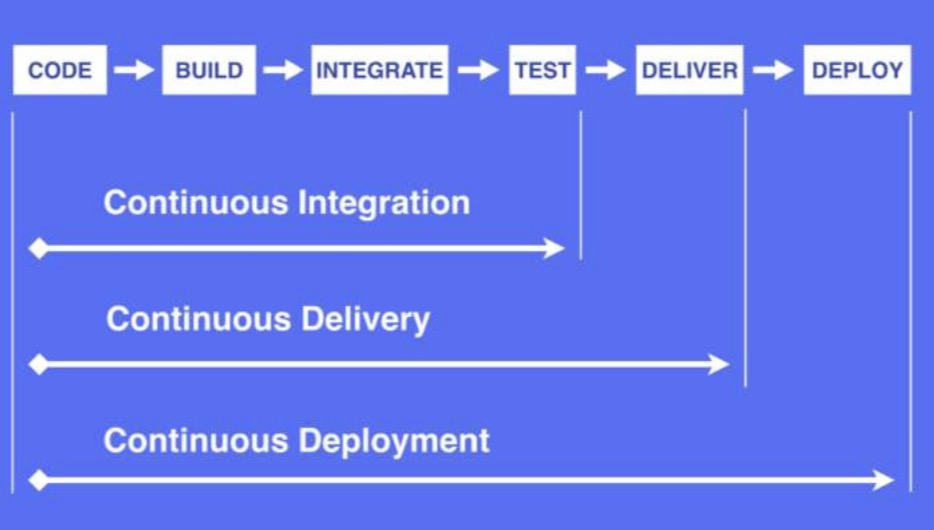

# 工程化入门
工程化主要关注的问题：持续集成，持续交付，持续部署。


- 持续集成。开发人员会频繁的提交代码到仓库，这些新的提交在合并到最终的主线之前都需要经过编译和自动化测试流进程验证。这样做可以保障提交的质量，对可能出现的问题进行预警。

- 持续交付。持续交付是将我们的应用发布出去的过程。这个过程可以确保尽可能快的实现交付。这就意味着出了自动化测试，还需要有自动化的发布流。通过持续交互可以每天、每周或者每两周发布一次。

- 持续部署。任何修改通过了所有已有的工作流就会直接部署上线。没有人为干预，没有一键部署按钮。这是一个很优秀的方式，可以加速用户的反馈循环，但是会给团队带来压力，对团队是一个考验。

## 前端工程目标
- 自动化编译

- 前端模块化

- 定位静态资源

- 前端开发组件化

- 自动化部署测试配合版本库

- 自动化性能优化

### 自动化编译
比如下面的代码：
```javascript
    //foo.es
    require('foo.scss')
    //foo.less
    background:url(foo.png)
```
自动化编译的流程为
- 读入foo.es的文件内容，编译成js内容
- 分析js内容，找到资源定位标记foo.scss
- 对foo.scss进行编译：
- 读入foo.scss的文件内容,编译成css内容
- 分析css内容，找到资源定位标记 `url(foo.png)`
- 对foo.png进行编译。包括读取foo.png的内容，压缩，返回图片内容
- 根据foo.png的内容计算md5，替换url(foo.png)为url(/static/img/foo_2adfd.png)。
- 替换完毕所有资源定位标记，对css内容进行压缩
- 返回css内容
- 根据foo.css最终内容计算md5，替换foo.scss为foo_3fjdd0.css
- 替换完所有的资源定位标记，对js内容进行压缩
- 返回js内容
- 根据最终的js内容计算md5，替换js

### 前端模块化
前端模块化肩负着模块管理和资源加载两项重要的功能。这两个功能与工具、性能、业务、部署等工程环节都有着非常紧密的联系。因此，模块化设计应该最高优先级考虑工程需要。现代前端编程中模块化的概念已经越来越淡了，原因是webpack为我们做了大部分模块化的工作。

下面来看看几种模块化的规范：
1. AMD（Asynchronous Module Definition）
它采用异步方式加载模块，模块的加载不影响它后面语句的执行。所有依赖这个模块的语句都定义在一个回调函数中，等模块加载完成之后，这个回调函数才会执行。用于浏览器端。
- 语法： 使用`require([module], callback)`获取依赖模块，使用`exports`导出API

AMD依赖前置，做不到需要时再加载。

2. CMD（Common Module Definition）
CMD是按需就近加载依赖，用到某个模块的再去require。

- 语法
```javascript
// 定义模块  myModule.js
define(function(require, exports, module) {
  var $ = require('jquery.js')
  $('div').addClass('active');
  exports.data = 1;
});

// 加载模块
seajs.use(['myModule.js'], function(my){
    var star= my.data;
    console.log(star);  //1
});

```
- 缺点：注释没用。require不能写变量。

3. CommonJS
CommonJS是服务器模块的规范。CommonJS模块加载是同步的。由于Nodejs加载模块的文件一般都已经存在本地，不考虑异步加载的方式。
- 语法：加载模块用require，导出用`module.exports`

4. Webpack
Webpack打包把所需要的js全部打包到一个js（除了异步的js）中，它实现CommonJS贵方

5. ES Module
使用import export。

### 静态资源定位
浏览器会对资源做缓存，如果没有做md5，要更新文件则不受控制。
给文件做md5可以平滑升级，因为老的文件还在。

## 可以自动化的东西
- 自动化运营平台
- 自动化雪碧图
- 自动化离线打包
- 自动化控制缓存级别
- 自动化处理inline
- 自动化根据网速分发版本资源
- 自动化运维平台

## 常用工具
- 构建工具：Webpack, Gulp
- 持续集成： Jenkins, Travis CI， Cicle CI
- 部署工具： rsync, shelljs, yargs


