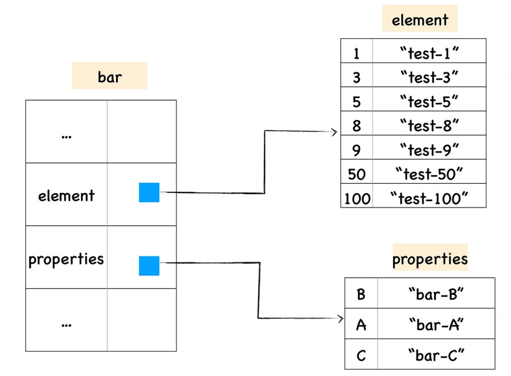
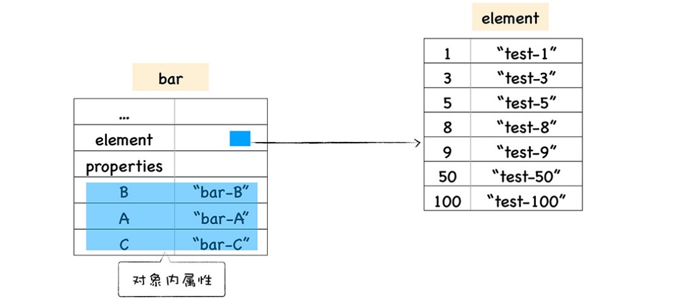
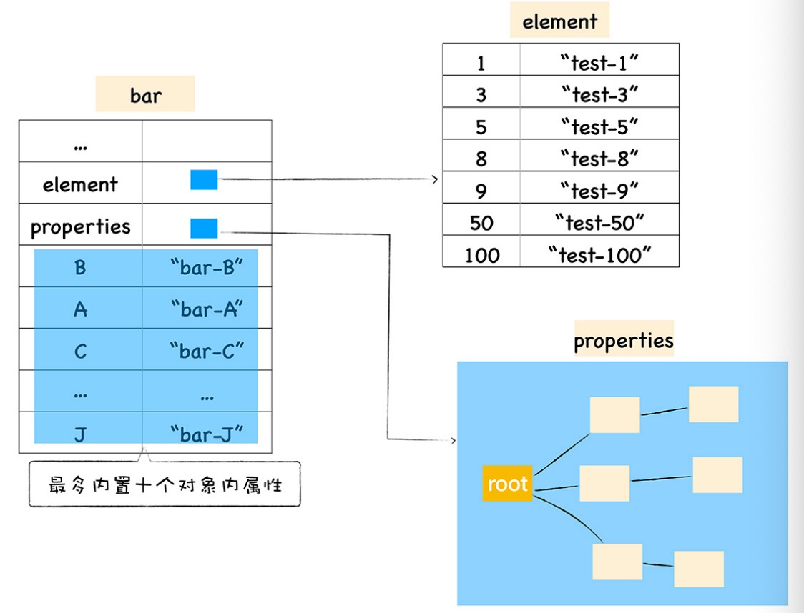
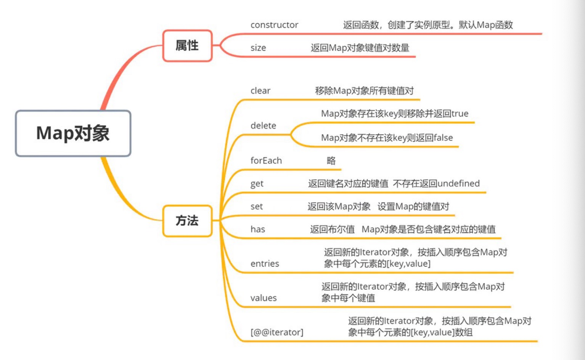
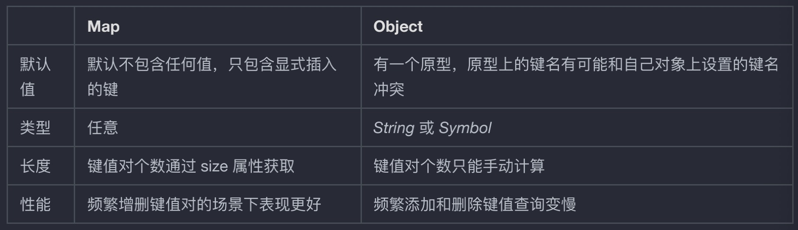

# Javascript 对象和 Map 实现原理

JavaScript 中几种常⻅的数据类型数组、对象、Map 和 Set，他们之间到底⼜有什么区别和联系呢，我们继续分析。⽼规矩还是先把⼀些所谓⾼⼤上的概念列出来：

- 常规属性 (properties) 和排序属性 (elements)
- 对象内属性 (in-object properties)
- 快属性和慢属性
- 快数组（FastElements）慢数组（SlowElements）
- Map 和 Set 的实现原理对⽐

一个对象在存储的时候，默认会将自己的 string 的 key 和 number 的 key 都暴露在外边。方便对象查找数据。默认情况下使用 string 的 key 的属性的值会存储在对象内属性 in-object properties 上。但是当发生某些情况时，将从 in-object properties 移到 properties 中。

经最新的测试，所有初始化创建的 string 为 key 属性，都是默认放在 in-object properties 中。动态添加的属性，如果小于等于 10 个，也是放在 in-object properties 中, 不创建 properties 数组。如果大于 10 个，前 10 个仍然存储在 in-object properties 内，超过的部分存储在 properties 中，为了方便查找，对象最外层也会复制一份 properties 里的引用。并且，如果保存在 properties 里的数组个数小于等 15 个，数组是线性存储的，大于 15 个之后就是散列的。

elements 里面存储的是所有 key 为 number 的属性的值，它其实是个变相的数组。它是实时动态调整的。经最新的测试，所有 key 为 number 的属性不管是动态创建的，还是初始化赋值的，都会存储到 elements 数组中，且一直保持顺序。

快属性和慢属性。快属性是说，当一个对象在创建的初期，里面有些数据会直接放到 in-object properties。但是如果动态的往里面加属性，那么有些属性会动态的放到外部的 properties 中。

快数组和慢速组。意思是有些情况数组是快数组，查找很快，有些情况查找很慢，是慢数组。

## 对象

JavaScript 对象像⼀个字典是由⼀组组属性和值组成的，所以最简单的⽅式是使⽤⼀个字典来保存属性和值，但是由于字典是⾮线性结构，所以如果使⽤字典，读取效率会⼤⼤降低。

V8 为了提升存储和查找效率，V8 在对象中添加了两个隐藏属性，排序属性和常规属性，element 属性指向了 elements 对象，在 elements 对象中，会按照顺序存放排序属性。properties 属性则指向了 properties 对象，在 properties 对象中，会按照创建时的顺序保存常规属性。

```javascript
/*
 * 1.数字属性被最先打印出来了，并且是按照数字⼤⼩的顺序打印的
 * 2.设置的字符串属性依然是按照之前的设置顺序打印的
 * 原因：ECMAScript 规范中定义了数字属性应该按照索引值⼤⼩升序排列，字符串属性根据创建时的顺序升序排列
 */
function Foo() {
  this[100] = "test-100";
  this[1] = "test-1";
  this["B"] = "bar-B";
  this[50] = "test-50";
  this[9] = "test-9";
  this[8] = "test-8";
  this[3] = "test-3";
  this[5] = "test-5";
  this["A"] = "bar-A";
  this["C"] = "bar-C";
}
var bar = new Foo();
for (key in bar) {
  console.log(`index:${key} value:${bar[key]}`);
}
console.log(bar);
// index:1 value:test-1
// VM66:21 index:3 value:test-3
// VM66:21 index:5 value:test-5
// VM66:21 index:8 value:test-8
// VM66:21 index:9 value:test-9
// VM66:21 index:50 value:test-50
// VM66:21 index:100 value:test-100
// VM66:21 index:B value:bar-B
// VM66:21 index:A value:bar-A
```

在对象中的数字属性称为排序属性，在 V8 中被称为 elements（elements 对象中，会按照顺序存放排序属性），
字符串属性就被称为常规属性，在 V8 中被称为 properties（按照创建时的顺序保存了常规属性）。bar 对象恰好
包含了这两个隐藏属性



如上在 V8 内部，为了有效地提升存储和访问这两种属性的性能，分别使⽤了两个线性数据结构来分别保存排序属性和常规属性。分解成这两种线性数据结构之后，如果执⾏索引操作，那么 V8 会先从 elements 属性中按照顺序读取所有的元素，然后再在 properties 属性中读取所有的元素，这样就完成⼀次索引操作。

2.我们来验证打印⼀下
当我们在浏览器⾥打印出来以后，并没有发现 properties

原因是 bar.B 这个语句来查找 B 的属性值，那么在 V8
会先查找出 properties 属性所指向的对象 properties，然后再在 properties 对象中查找 B 属性，这种⽅式在查找过程中增加了⼀步操作，因此会影响到元素的查找效率。

所以 V8 采取了⼀个权衡的策略以加快查找属性的效率，这个策略是将部分常规属性直接存储到对象本身，我们把这称为对象内属性 (in-object properties)。对象在内存中的展现形式你可以参看下图：


不过

保存在线性数据结构中的属性称之为“快属性”，因为线性数据结构中只需要通过索引即可以访问到属性，虽然访问线性结构的速度快，但是如果从线性结构中添加或者删除⼤量的属性时，则执⾏效率会⾮常低，这主要因为会产⽣⼤量时间和内存开销。

因此，如果⼀个对象的属性过多时，V8 就会采取另外⼀种存储策略，那就是“慢属性”策略，但慢属性的对象内部会有独⽴的⾮线性数据结构 (词典) 作为属性存储容器。所有的属性元信息不再是线性存储的，⽽是直接保存在属性字典中。



```javascript
//我们⼀起测试⼀下V8
function Foo(property_num, element_num) {
  //添加可索引属性
  for (let i = 0; i < element_num; i++) {
    this[i] = `element${i}`;
  }
  //添加常规属性
  for (let i = 0; i < property_num; i++) {
    let ppt = `property${i}`;
    this[ppt] = ppt;
  }
}
var bar = new Foo(10, 10);

//貌似哪⾥有些问题？
//The number of in-object properties is predetermined by the initial size of the object.
function init() {
  var yideng = {
    0: "item0",
    1: "item1",
    2: "item2",
    3: "item3",
    4: "item4",
    5: "item5",
    6: "item6",
    7: "item7",
    yideng1: "item-yideng1",
  };
  return function apple() {
    console.log(yideng);
  };
}
var result = init();
result();
```

可以发现，往 Object 里动态添加属性时，10 个限制不受控制？动态创建的属性，将直接放进 properties 里，同时也会在 in-object properties 里也复制一份，但是在 in-object properties 上的值只是为了方便查找，存储的是 properties 里对应值的地址，实际存储还是在 properties 里。在初期创建的时候，如果 string 为 key 的属性都会存储到 in-object

通过引⼊这两个属性，加速了 V8 查找属性的速度，为了更加进⼀步提升查找效率，V8 还实现了内置属性的策略，当常规属性少于⼀定数量时，V8 就会将这些常规属性直接写进对象中，这样⼜节省了⼀个中间步骤。

最后如果对象中的属性过多时，或者存在反复添加或者删除属性的操作，那么 V8 就会将线性的存储模式降级为⾮线性的字典存储模式，这样虽然降低了查找速度，但是却提升了修改对象的属性的速度。

## 数组

数组 它的这种特定的存储结构（连续存储空间存储同⼀类型数据）决定了，优点就是可以随机访问（可以通过下标随机访问数组中的任意位置上的数据），缺点（对数据的删除和插⼊不是很友好）。JavaScript 的数组过于灵活。

```javascript
// ---当栈⽤---
let stack = [1, 2, 3];
// 进栈
stack.push(4);
// 出栈
stcak.pop();

//---当队列⽤---
let queue = [1, 2, 3];
// 进队
queue.push(4);
// 出队
queue.shift();
/*
 *综上所述：有以下的结论
 *查找： 根据下标随机访问的时间复杂度为 O(1)； *插⼊或删除： 时间复杂度为 O(n)；
 */
```

JavaScript 的数组过于灵活。 1.数组为什么可以保存不同类型？ 2.数组是如何存储的？ 3.数组的动态扩容与减容？

### 数组为什么可以保存不同类型？

JSArray 是继承⾃ JSObject 的，所以在 JavaScript 中，数组可以是⼀个特殊的对象，内部也是以 key-value 形式存储数据，所以 JavaScript 中的数组可以存放不同类型的值。

```javascript
//JSArray 是继承⾃ JSObject 的，所以在 JavaScript 中，数组可以是⼀个特殊的对象，内部也是以key-value 形式存储数据，所以 JavaScript 中的数组可以存放不同类型的值。
// The JSArray describes JavaScript Arrays
// Such an array can be in one of two modes:
// - fast, backing storage is a FixedArray and length <= elements.length();
// Please note: push and pop can be used to grow and shrink the array.
// - slow, backing storage is a HashTable with numbers as keys.
class JSArray: public JSObject {
public:
// [length]: The length property.
DECL_ACCESSORS(length, Object)
// ...
// Number of element slots to pre-allocate for an empty array.
static const int kPreallocatedArrayElements = 4;
};
```

### 数组是如何存储的？

JSArray 继承于 JSObject ，从注释上看，它有两种存储⽅式：

- fast：存储结构是 FixedArray ，并且数组⻓度 <= elements.length() ， push 或 pop 时可能会伴随着动态扩容或减容
- slow：存储结构是 HashTable （哈希表），并且数组下标作为 key

1. 快数组（FastElements）
   FixedArray 是 V8 实现的⼀个类似于数组的类，它表示⼀段连续的内存，可以使⽤索引直接定位。**新创建的空数组默认就是快数组**。当数组满（数组的⻓度达到数组在内存中申请的内存容量最⼤值）的时候，继续 push 时， JSArray 会进⾏动态的扩容，以存储更多的元素。

2. 慢数组
   慢数组以哈希表的形式存储在内存空间⾥，它不需要开辟连续的存储空间，但需要额外维护⼀个哈希表，与快数组相⽐，性能相对较差。

```javascript
// src/objects/dictionary.h
// 从源码中可以看出，它的内部就是⼀个 HashTable
class EXPORT_TEMPLATE_DECLARE(V8_EXPORT_PRIVATE) Dictionary
 : public HashTable<Derived, Shape> {
using DerivedHashTable = HashTable<Derived, Shape>;
public:
using Key = typename Shape::Key;
// Returns the value at entry.
inline Object ValueAt(InternalIndex entry);
inline Object ValueAt(const Isolate* isolate, InternalIndex entry);
// ...
};
```

3. 什么时候从快数组变慢数组？
   初始是 1024。快数组新容量是扩容前的容量 3 倍之多时，也会被转成慢数组

```javascript
// src/objects/js-objects.h
static const uint32_t kMaxGap = 1024;
// src/objects/dictionary.h
// JSObjects prefer dictionary elements if the dictionary saves this much
// memory compared to a fast elements backing store.
static const uint32_t kPreferFastElementsSizeFactor = 3;
// src/objects/js-objects-inl.h
// If the fast-case backing storage takes up much more memory than a
dictionary
// backing storage would, the object should have slow elements.
// static
static inline bool ShouldConvertToSlowElements(uint32_t used_elements,
uint32_t new_capacity) {
uint32_t size_threshold = NumberDictionary::kPreferFastElementsSizeFactor
*
NumberDictionary::ComputeCapacity(used_elements) *
NumberDictionary::kEntrySize;
// 快数组新容量是扩容后的容量3倍之多时，也会被转成慢数组
return size_threshold <= new_capacity; }
static inline bool ShouldConvertToSlowElements(JSObject object,
uint32_t capacity,
uint32_t index,
uint32_t* new_capacity) {
STATIC_ASSERT(JSObject::kMaxUncheckedOldFastElementsLength <=
JSObject::kMaxUncheckedFastElementsLength);
if (index < capacity) {
*new_capacity = capacity;
return false; }
// 当加⼊的索引值（例如例3中的2000）⽐当前容量capacity ⼤于等于 1024时，
// 返回true，转为慢数组
if (index - capacity >= JSObject::kMaxGap) return true; *new_capacity = JSObject::NewElementsCapacity(index + 1);
DCHECK_LT(index, *new_capacity);
// TODO(ulan): Check if it works with young large objects.
if (*new_capacity <= JSObject::kMaxUncheckedOldFastElementsLength ||
(*new_capacity <= JSObject::kMaxUncheckedFastElementsLength &&
ObjectInYoungGeneration(object))) {
return false; }
return ShouldConvertToSlowElements(object.GetFastElementsUsage(),
*new_capacity);
}
```

所以，当处于以下情况时，快数组会被转变为慢数组：

- 当加⼊的索引值 index ⽐当前容量 capacity 差值⼤于等于 1024 时（index - capacity >= 1024）
- 快数组新容量是扩容前的容量 3 倍之多时
  例如：向快数组⾥增加⼀个⼤索引同类型值

```javascript
var arr = [1, 2, 3];
arr[2000] = 10;
```

当往 arr 增加⼀个 2000 的索引时， arr 被转成慢数组。节省了⼤量的内存空间（从索引为 2 到索引为 2000）。

### 什么时候会从 slow 编成 fast?

```javascript
static bool ShouldConvertToFastElements(JSObject object,
NumberDictionary dictionary,
uint32_t index,
uint32_t* new_capacity) {
// If properties with non-standard attributes or accessors were added, we
// cannot go back to fast elements.
if (dictionary.requires_slow_elements()) return false;
// Adding a property with this index will require slow elements.
if (index >= static_cast<uint32_t>(Smi::kMaxValue)) return false;
if (object.IsJSArray()) {
Object length = JSArray::cast(object).length();
if (!length.IsSmi()) return false; *new_capacity = static_cast<uint32_t>(Smi::ToInt(length));
} else if (object.IsJSArgumentsObject()) {
return false;
} else {
*new_capacity = dictionary.max_number_key() + 1; }*new_capacity = Max(index + 1, *new_capacity);
uint32_t dictionary_size = static_cast<uint32_t>(dictionary.Capacity()) *
NumberDictionary::kEntrySize;
// Turn fast if the dictionary only saves 50% space.
return 2 * dictionary_size >= *new_capacity; }
```

当慢数组的元素可存放在快数组中且⻓度在 smi 之间且仅节省了 50%的空间，则会转变为快数组

## 数组动态扩容与减容

```javascript
// 默认的数组⻓度是4
// Number of element slots to pre-allocate for an empty array.
static const int kPreallocatedArrayElements = 4;
//-----扩容后新容量计公式----
new_capacity = old_capacity / 2 + old_capacity + 16
//即⽼的容量的 1.5 倍加上 16 。初始化为 4 个，当 push 第 5 个的时候，容量将会变成：
//new_capacity = 4 / 2 + 4 + 16 = 22
//接着申请⼀块这么⼤的内存，把⽼的数据拷过去，把新元素放在当前 length 位置，然后将数组的
length + 1，并返回 length。
//-----判断是否进⾏减容----
if (2 * length <= capacity) {
// If more than half the elements won't be used, trim the array.
isolate->heap()->RightTrimFixedArray(*backing_store, capacity - length);
} else {
// Otherwise, fill the unused tail with holes.
BackingStore::cast(*backing_store)->FillWithHoles(length, old_length);
}
//当数组 pop 后，如果数组容量⼤于等于 length 的 2 倍，则进⾏容量调整，使⽤
RightTrimFixedArray 函数，计算出需要释放的空间⼤⼩，做好标记，等待 GC 回收；如果数组容量⼩于
length 的 2 倍，则⽤ holes 对象填充。
```

JavaScript 中， JSArray 继承⾃ JSObject ，或者说它就是⼀个特殊的对象，内部是以 key-value 形式存储数据，所以 JavaScript 中的数组可以存放不同类型的值。它有两种存储⽅式，快数组与慢数组，初始化空数组时，使⽤快数组，快数组使⽤连续的内存空间，当数组⻓度达到最⼤时， JSArray 会进⾏动态的扩容，以存储更多的元素，相对慢数组，性能要好得多。当数组中 hole 太多时，会转变成慢数组，即以哈希表的⽅式（ key-value 的形式）存储数据，以节省内存空间。

## Map



map 和 Object 对比



「Object」不同于「Map」，它不仅仅是表⾯所看到的。「Map」只包含你所定义的键值对，但是「Object」对象具有其原型中的⼀些内置属性

```javascript
//如果不⼩⼼设置了⼀些内置属性 直接报错了
const countWords = (words) => {
const counts = { };
for (const word of words) {
counts[word] = (counts[word] || 0) + 1;
 }
return counts;
};
const counts = countWords(['constructor', 'creates', 'a', 'bug']);
// {constructor: "function Object() { [native code] }1", creates: 1, a: 1, bug:
1}
```

「Map」是⼀个纯哈希结构，始终保持对⻓度的跟踪，使其能够在 O(1)复杂度中进⾏访问

⽽另⼀⽅⾯，对于「Object」⽽⾔，想要获得对象的属性⻓度，需要⼿动对其进⾏迭代，使其为 O(n)复杂度，属性
⻓度为 n 。「Map」始终保持按插⼊顺序返回键名。但「Object」却不是。所以当你需要频繁操作数据的时候也可
以优先考虑 Map
