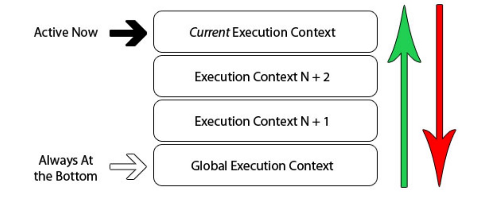

# javascript 执行堆栈

当 Javascript 代码执⾏的时候会将不同的变量存于内存中的不同位置：堆（heap）和栈（stack）中来加
以区分。其中，堆⾥存放着⼀些对象。⽽栈中则存放着⼀些基础类型变量以及对象的指针。 但是我们这
⾥说的执⾏栈和上⾯这个栈的意义却有些不同。
js 在执⾏可执⾏的脚本时，⾸先会创建⼀个全局可执⾏上下⽂ globalContext，每当执⾏到⼀个函数调⽤
时都会创建⼀个可执⾏上下⽂（execution context）EC。当然可执⾏程序可能会存在很多函数调⽤，那
么就会创建很多 EC，所以 JavaScript 引擎创建了执⾏上下⽂栈（Execution context stack，ECS）来管
理执⾏上下⽂。当函数调⽤完成，js 会退出这个执⾏环境并把这个执⾏环境销毁，回到上⼀个⽅法的执⾏
环境... 这个过程反复进⾏，直到执⾏栈中的代码全部执⾏完毕，如下是以上的⼏个关键词：

- 执⾏栈（Execution Context Stack）
- 全局对象（GO Global Object)
- 活动对象（Activation Object）
- 变量对象（Variable Object）
- 全局上下⽂(GC global execution context )
- 执⾏上下⽂（EC execution context）
- 函数调⽤栈（Callee Stack)
- 执⾏上下⽂栈（ECS execution context Stack )
- 垃圾回收（GC Garbage Collection ）
- 词法环境（LexicalEnvironment）
- 变量环境（VariableEnvironment）
- 环境记录（Environment record)



## [执⾏栈（Execution Context Stack）]

浏览器解释器执⾏ js 是单线程的过程，这就意味着同⼀时间，只能有⼀个事情在进⾏。其他的活动和事件只能排队等候，⽣成出⼀个等候队列执⾏栈（Execution Stack）。

## 执⾏栈压栈顺序

⼀开始执⾏代码的时候，变确定了⼀个全局执⾏上下⽂ global execution context 作为默认值。如果在你的全局环境中，调⽤了其他的函数，程序将会再创建⼀个新的 EC，然后将此 EC 推⼊进执⾏栈中 execution stack

如果函数内再调⽤其他函数，相同的步骤将会再次发⽣：创建⼀个新的 EC -> 把 EC 推⼊执⾏栈。⼀旦⼀个 EC 执⾏完成，变回从执⾏栈中推出（pop）。ESP 指针负责 EC 出栈指向。

```javascript
ECStack = [
• globalContext
];
```

1. 继续分析压栈过程

```javascript
function fun3() {
  console.log("fun3");
}
function fun2() {
  fun3();
}
function fun1() {
  fun2();
}
fun1();
//执⾏fun1 结果如下
ECStack = [fun1, globalContext];
```

2. 变量对象（Variable Object）

变量对象 VO 是与执⾏上下⽂相关的特殊对象,⽤来存储上下⽂的函数声明，函数形参和变量。

```javascript
//变量对象VO存储上下⽂中声明的以下内容
{
//1-1 函数声明FD(如果在函数上下⽂中),—-不包含函数表达式
//1-2 函数形参function arguments,
//1-3 变量声明–注意b=10不是变量，但是var b = 10;是变量，有变量声明提升
//alert(a); // undefined
//alert(b); // “b” 没有声明
//b = 10;
//var a = 20;
}
var a = 10;
function test(x) {
var b = 20;
};
test(30);
// 全局上下⽂的变量对象
VO(globalContext) = {
a: 10,
test: <reference to function>
};
// test函数上下⽂的变量对象
VO(test functionContext) = {
x: 30, b: 20
};
//VO分为 全局上下⽂的变量对象VO，函数上下⽂的变量对象VO
VO(globalContext) === global;
```

3. 活动对象（Activation Object）
   在函数上下⽂中，变量对象被表示为活动对象 AO,当函数被调⽤后，这个特殊的活动对象就被创建了。它包含普通参数与特殊参数对象（具有索引属性的参数映射表）。活动对象在函数上下⽂中作为变量对象使⽤。

```javascript
//1.在函数执⾏上下⽂中，VO是不能直接访问的，此时由活动对象扮演VO的⻆⾊。
//2.Arguments对象它包括如下属性：callee 、length
//3.内部定义的函数
//4.以及绑定上对应的变量环境；
//5.内部定义的变量
VO(functionContext) === AO;
function test(a, b) {
  var c = 10;
  function d() {}
  var e = function _e() {};
  (function x() {});
}
test(10); // call
// 当进⼊带有参数10的test函数上下⽂时，AO表现为如下：

//AO⾥并不包含函数“x”。这是因为“x” 是⼀个函数表达式(FunctionExpression, 缩写为 FE) ⽽不是函数声明，函数表达式不会影响VO
AO(test) = {
a: 10, b: undefined, c: undefined, d: <reference to FunctionDeclaration "d"> e: undefined
};
```

4. 深度活动对象（Activation Object）

```javascript
//Activation Object 分为创建阶段和执⾏阶段
function foo(i) {
var a = 'hello';
var b = function privateB() {
 };
function c() {
 }
}
foo(22);
//当我们执⾏foo(22)的时候，EC创建阶段会类似⽣成下⾯这样的对象：
fooExecutionContext = {
scopeChain: { Scope },
AO: {
arguments: {
0: 22,
length: 1
 },
i: 22, c: pointer to function c()
a: undefined, b: undefined
 },
VO:{..}
Scope: [AO, globalContext.VO],
}
//在创建阶段，会发⽣属性名称的定义，但是并没有赋值(变量提升阶段)。⼀旦创建阶段（creationstage）结束，变进⼊了激活 / 执⾏阶段，那么fooExecutionContext便会完成赋值，变成这样：
//【 运⾏函数内部的代码，对变量复制，代码⼀⾏⼀⾏的被解释执⾏ 】
fooExecutionContext = {
scopeChain: { ... },
AO: {
arguments: {
0: 22,
length: 1
 },
i: 22,
c: pointer to function c()
a: 'hello', b: pointer to function privateB()
 },
VO:{..}
Scope: [AO, globalContext.VO],
this: { 运⾏时确认 }
}
```

7. 写到最后
   当⼀个异步代码（如发送 ajax 请求数据）执⾏后会如何呢？接下来需要了解的另⼀个概念就是：事件队列（Task Queue）。

   当 js 引擎遇到⼀个异步事件后，其实不会说⼀直等到异步事件的返回，⽽是先将异步事件进⾏挂起。等到异步事件执⾏完毕后，会被加⼊到事件队列中。（注意，此时只是异步事件执⾏完成，其中的回调函数并没有去执⾏。）当执⾏队列执⾏完毕，主线程处于闲置状态时，会去异步队列那抽取最先被推⼊队列中的异步事件，放⼊执⾏栈中，执⾏其中的回调同步代码。如此反复，这样就形成了⼀个⽆限的循环。就是这个过程被称为“事件循环（Event Loop）”的原因。
