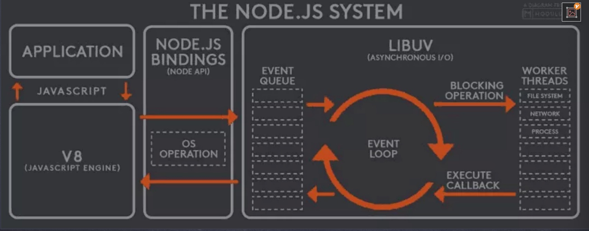
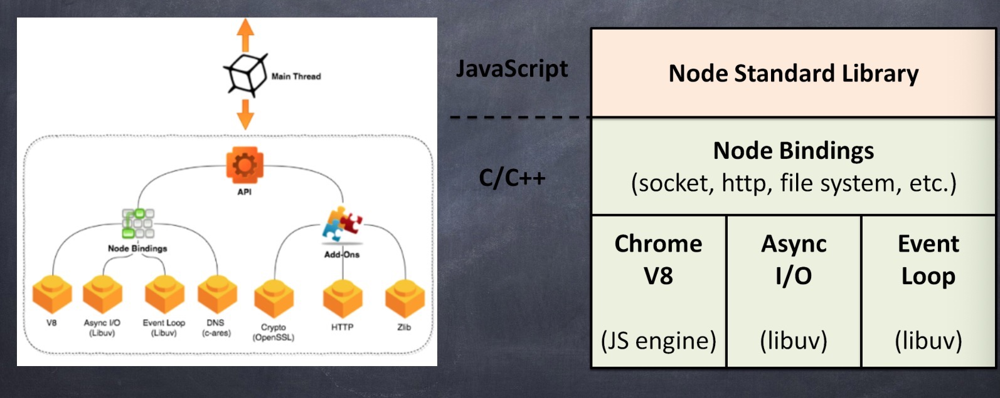
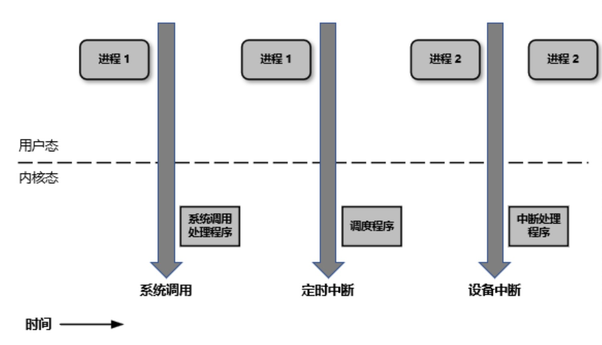
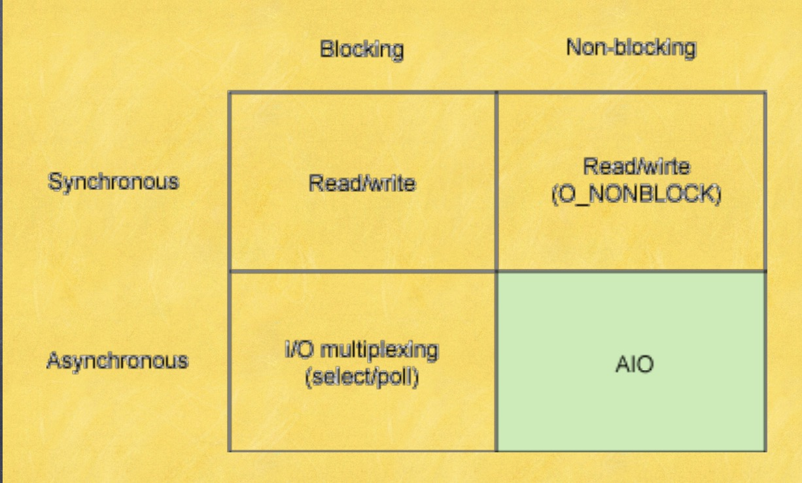
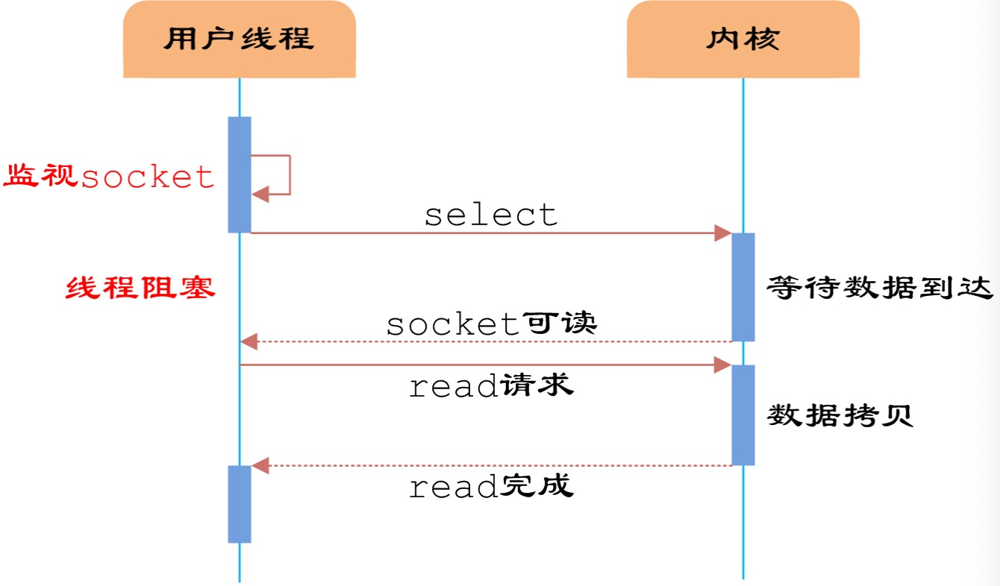
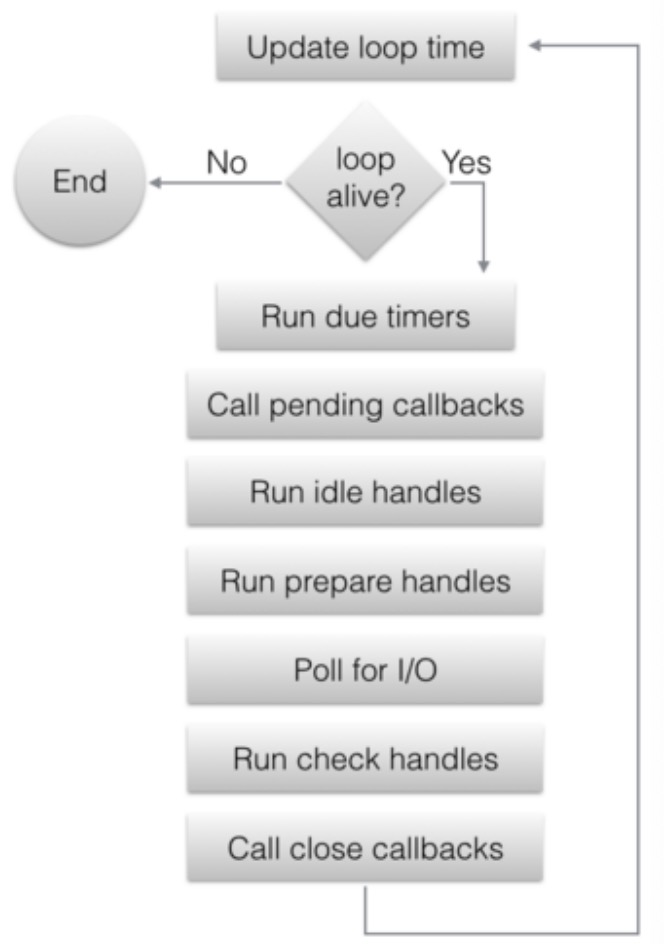

# V8 源码（一）

本节主要回顾 C 语言基础以及 V8 引擎与 Linux 异步机制。

## CPU 是怎样工作的

CPU 有很多系列，有 X86/X64 的，ARM 指令集的，MIPS 指令集的，RISC 指令集的。
CPU 主要由控制器、运算器和存储器三部分组成。控制器发送控制指令，去操作存储单元和运算器，运算器从存储单元取数据进行读取和修改，然后写会存储器。

控制单元里有指令计数器和指令寄存器。指令计数器记录指令地址，指令寄存器存储了具体指令。

程序在内存里以进程形式表现。进程分为代码段和数据段。代码段存储了指令，数据段存储代码里写的变量等。

### C 语言和 JS 的异同

- C 语言是编译型语言，JS 是解释性
- C 语言需要借助编译器转换成可执行程序
- JS 需要借助解释引擎运行

## 内存动态分配

内存分为栈区、堆区、全局区/静态区和程序代码区。

- 栈区。是一个确定的常数(1-2M),不同平台会有不同大小，如果溢出，会提示 stackoverflow。它的特点是自动分配自动释放。
- 堆区。用于动态内存分配。手动分配，手动释放。可占 80%的内存。
- 静态区。在程序中明确被初始化的全局变量、静态变量和常量数据。只初始化一次。
- 程序代码区。代码区指令根据程序设计流程依次执行。对于顺序指令，则只会执行一次，如果是循环，则需要使用跳转指令，如果进行递归，需要借助栈来实现。

## Nodejs 和 V8 引擎结构

V8 引擎本身是单线程的东西，但是它为什么能够处理多线程的任务？接下来看看。

### Nodejs 系统体系

Nodejs 体系的核心是事件循环。V8 本身是一个单线程的引擎，单线程是是同步阻塞式的，处理并发任务就不行了。

在 JS 中我们需要进行网络请求、读取文件，这些都是异步的。

Nodejs 中引入了 Event Loop 来解决同步和异步问题。



Nodejs 各模块功能

- Application
  存放了我们写的代码。

- V8
  V8 是 Javascript 解释引擎。

如果我们发起一个网络请求，网络请求是操作系统提供的，V8 是直接操作不了操作系统的。需要 Nodejs Bindings 帮我们实现。

- Nodejs Bindings(Node API)
  这一层封装了操作系统调用。这一层是真正属于 Nodejs 自己的东西。

请求发出去之后，JS 注册了回调函数，那这个回调什么时候执行？从哪回调回来的？这个时候就需要事件循环。

事件循环是基于 Libuv 这个库来开发的

- Libuv
  Libuv 提供了一套事件循环的机制。

例如：应用层写了一个网络请求，走到 V8，V8 需要注册一个事件。这个事件会进入到 Libuv 的事件队列里。然后进入 Event Loop 等待操作系统的调用。当得到操作系统调用之后，找到事件的回调函数，执行回调函数。

Event Loop 会不断地检查事件队列里的任务，哪一个需要被触发。哪一个被触发是由操作系统决定的。事件执行完成后，Event Loop 接收操作系统的回调，找到对应时间的回调并执行。

Nodejs 里 V8 是一个线程， Libuv 里 Event Loop 也是一个线程。Libuv 里操作系统操作网络、文件也有自己独立的线程（叫 Worker Threads）

Nodejs 设计这套系统，主要为了实现非阻塞调用,尤其擅长 IO 密集型任务。

### Nodejs 结构

我们 JS 程序启动，就会启动 Nodejs 这个进程，进程里面有一个主线程。V8 就是在这个主线程里执行。

Node Bindings 就是一个框架+插槽。里面接了 V8，异步 IO 操作和事件循环，DNS。

那 Http 请求这些从哪儿来，也是从第三方来的。这些东西以插件形式接入到 Nodejs。如果我们想要自定义插件实现操作底层，就可以自己写个库接在 Add-ones 上。



## Linux 异步机制

### Linux 用户空间与内核空间

内核要做的事，叫内核空间。用户空间是自己写的程序。操作系统内核里提供了网络请求、文件系统和操作硬件的功能， 这些就是系统调用。程序执行过程中不断地在内核空间和用户空间切换。

```c
 int a = 1 //(用户空间)
 print("%d", a); //内核空间
```

为什么要区分内核空间与用户空间？隔离。

操作系统分片执行系统调用的。处理器在任何指定的时间点上的活动可以概括为下列三者之一：

- 运行于用户空间，执行用户进程
- 运行于内核空间，处于进程上下文，代表某个特定的进程执行
- 运行于内核空间，处于中断上下文，与任何进程无关，处理某个特定的中断
  

  那么，是怎么进行切换的呢？这就需要信号机制。

### Linux 的信号机制

软中断信号（signal，又简称为信号）用来通知进程发生了异步事件。进程之间可以互相通过系统调用 kill 发送软中断信号。
内核也可以因为内部事件而给进程发送信号，通知进程发生了某个事件。信号只是用来通知某进程发生了什么事件，并不给
该进程传递任何数据。

- 对信号的处理方法：
  1、对于需要处理的信号，进程可以指定处理函数，由该函数来处理。

2、忽略某个信号，对该信号不做任何处理，就象未发生过一样。其中，有两个信号不能忽略：SIGKILL 及 SIGSTOP；

3、对该信号的处理保留系统的默认值，这种缺省操作，对大部分的信 号的缺省操作是使得进程终止。进程通过系统调
用 signal 来指定进程对某个信号的处理行为。

- 内核处理一个进程收到的信号的时机是在一个进程从内核态返回用户态时。所以，当一个进程在内核态下运行时，软中断信
  号并不立即起作用，要等到将返回用户态时才处理。进程只有处理完信号才会返回用户态，进程在用户态下不会有未处理完
  的信号。

- 可使用 linux 命令 kill -l 查看所有信号的定义。 kill 是用来发信号的并不做杀进程。kill -9 表示发第 9 号信号。

### Linux 中的 I/O 模型

一共有四种模型，由同步和异步、阻塞和非阻塞组合而成。

- 同步和异步

- 阻塞和非阻塞

- 每一个 I/O 模型都有它适合的应用场景



### 同步阻塞 I/O 模型

同步阻塞 I/O 模型是最常见的模型之一。用户空间的应用程序在执行系统调用
之后会被阻塞，直到系统调用完成
（数据传输完成或者出现错误）。此
时应用程序只是处于简单的等待响应
状态不会消耗 CPU。

站在 CPU 的角度他是高效的。

### 同步非阻塞 I/O 模型

同步阻塞 I/O 的一种变体是效率较
低的同步非阻塞 I/O。这个模式类似轮询。

非阻塞意味着如果 I/O 操作不能立
即完成，则需要应用程序多次调
用直到任务完成。

这可能非常低效，因为大多数时
候应用程序必须忙等待或者尝试
做其他事情直到数据可用。

### 异步阻塞 I/O 模型

设备以非阻塞方式打开，然后应用程序阻塞
在 select 系统调用中，用它来监听可用的 I/
O 操作。select 帮我们负责等待操作系统调用。

select 系统调用最大的好处是可以监听多个
描述符，而且可以指定每个描述符要监听的
事件：可读事件、可写事件和发生错误事件。

select 系统调用的主要问题是效率不高。虽
然它是一个非常方便的异步通知模型，但不
建议将其用于高性能 I/O 中。select 一旦多了，效率下降明显。

高性能场景一般使用 epoll 系统调用

### 异步非阻塞 I/O 模型

异步非阻塞 I/O 模型是可以并行处理 I/O 的
模型。

异步非阻塞 I/O 模型的读请求会立即返
回，表明读操作成功启动。然后应用程
序就可以在读操作完成之前做其他的事
情。当读操作完成时，内核可以通过信
号或者基于线程的回调函数来通知应用
程序读取数据。

在单个进程可以并行执行多个 I/O 请求是
因为 CPU 的处理速度要远大于 I/O 的处理
速度。 当一个或多个 I/O 请求在等待处理
时，CPU 可以处理其他任务或者处理其他
已完成的 I/O 请求。

接下来看下两种系统调用

### select

select 模型的关键是使用一种有序的方式，对多个套接字进行统一管理与调度。它是基于文件描述符，文件描述符在操作系统中是有上限的。



select 模型的缺点：

- 单个进程能够监视的文件描述符的数量存在最大限制，通常是 1024，当然可以更改数量，但由 select 采用轮询的方式扫描文件描述符，文件描述符数量越多，性能越差；(在 linux 内核头文件中，有这样定义：#define \_\_FD_SETSIZE 1024)

- 内核/用户空间内存拷贝问题，select 需要复制大量的句柄数据结构，产生巨大的开销；
- select 返回的是含有整个句柄的数组，应用程序需要遍历整个数组才能发现哪些句柄发生了事件；

- select 的触发方式是水平触发，应用程序如果没有完成对一个已经就绪的文件描述符进行 IO 操作，那么之后每次 select 调用还是会将这些文件描述符通知进程。

### epoll

epoll 模型的优点：

- 支持一个进程打开大数目的 socket 描述符
- IO 效率不随 FD 数目增加而线性下降
- 使用 mmap 加速内核与用户空间的消息传递

epoll 的两种工作模式：

- LT(level triggered，水平触发模式)是缺省的工作方式，并且同时支持 block 和 non-block
  socket。在这种做法中，内核告诉你一个文件描述符是否就绪了，然后你可以对这个就绪的 fd 进行 IO 操作。如果你不作任何操作，内核还是会继续通知的，所以，这种模式编程出错误可能性要小一点。比如内核通知你其中一个 fd 可以读数据了，你赶紧去读。你还是懒懒散散，不去读这个数据，下一次循环的时候内核发现你还没读刚才的数据，就又通知你赶紧把刚才的数据读了。这种机制可以比较好的保证每个数据用户都处理掉了。

- ET(edge-triggered，边缘触发模式)是高速工作方式，只支持 no-block socket。在这种模式下，当描述符从未就绪变为就绪时，内核通过 epoll 告诉你。然后它会假设你知道文件描述符已经就绪，并且不会再为那个文件描述符发送更多的就绪通知，等到下次有新的数据进来的时候才会再次出发就绪事件。简而言之，就是内核通知过的事情不会再说第二遍，数据错过没读，你自己负责。这种机制确实速度提高了，但是风险相伴而行。

### libUV

- libuv 是用 C 写的，因此，它具有很高的可移植性，非常适用嵌入到像 JavaScript 和 Python 这样的高级语言中。

- libuv 使用异步，事件驱动的编程方式，核心是提供 i/o 的事件循 s 环和异步回调。

- libuv 的 API 包含有时间，非阻塞的网络，异步文件操作，子进程等等。

- 当程序在等待 i/o 完成的时候，我们希望 cpu 不要被这个等待中的程序阻塞，libuv 提供的编程方式使我们开发异步程序变得简单。


