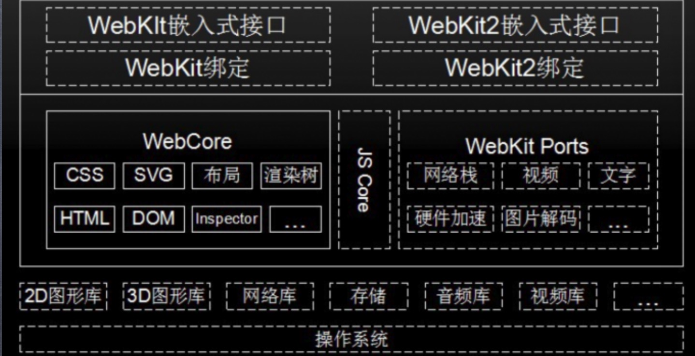
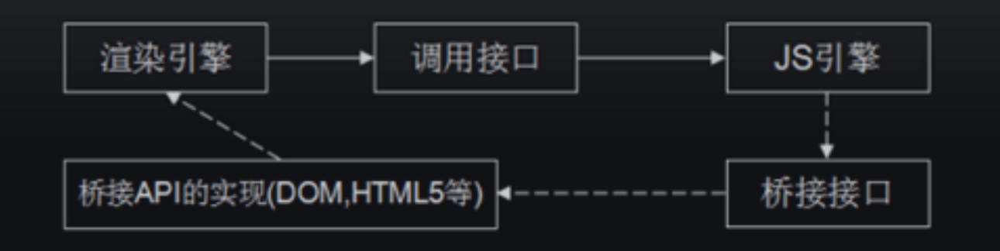
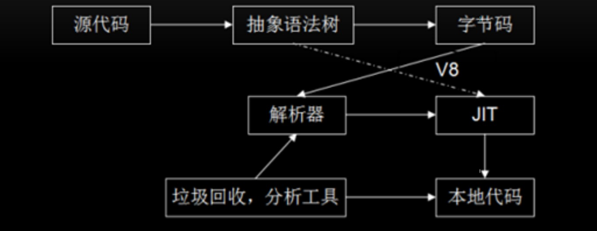

# V8 源码分析（二）V8 引擎

## 渲染引擎及 Webkit 体系结构

渲染引擎负责将 HTML/CSS/Javascript 文本及相应的资源文件转换成图像结果。

渲染引擎的种类有

- Tridend(IE)
- Gecko(Firefox)
- Webkit(Safari,chrome,android)

  webkit 框架如下图所示:
  

Webkit 对外提供接口。JSCore 是苹果的渲染引擎，WebCore 是 Chome 的。

WebkitPort 负责调用底层库，如图形库，网络库，视频库等。

### Javascript 引擎和渲染引擎

渲染引擎使用 JS 引擎的接口来处理逻辑代码并获取接口。

JS 引擎跳过桥接接口访问渲染引擎中的 DOM 及 CSSOM。

渲染引擎在遇到了 JS 后，会停止解析，去处理 JS。渲染引擎调用 JS 引擎接口，再通过桥接接口发送一个消息给到渲染引擎。

那 JS 引擎的工作流程又是什么样的？

JS 引擎，V8 也是一个 JS 引擎，先把源代码转成 AST，然后转成字节码，字节码给到解析器解析，再丢给 JIT(Just In Time) 做运行时优化，最后生成本地代码。

### V8 和 JavascriptCore

JavaScript Core 引擎是 WebKit 中默认的 JavaScript 引擎，也是苹果开源的一个项目，应用较为广泛。最初，性能不是很好，从 2008 年开始了一系列的优化，重新实现了编译器和字节码解释器，使得引擎的性能有较大的提升。随后内嵌缓存、基于正则表达式的 JIT、简单的 JIT 及字节码解释器等技术引入进来，JavaScriptCore 引擎也
在不断的迭代和发展。

JavaScriptCore 与 V8 有一些不同之处，其中最大的不同就是新增了字节码的中间表示，并加入了多层 JIT 编译器（如：简单 JIT 编译器、DFG JIT 编译器、LLVM 等）优化性能，不停的对本地代码进行优化。

## 源码

### 工作过程

### 数据表示

### 类型

### 内存管理

### 绑定机制和扩展机制

### 字节码和 JIT
