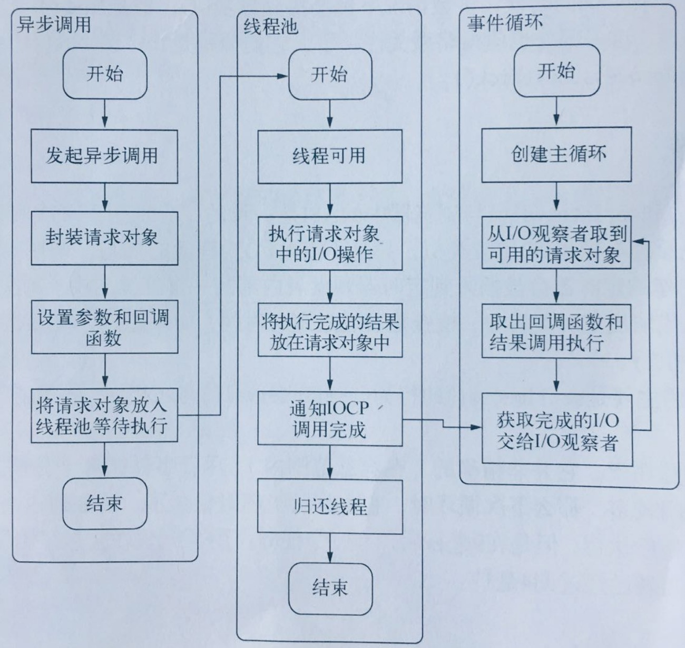

# V8 分析（三）

## libuv

libuv 不属于 V8，但是在执行过程中扮演了一个很重要的角色。

在 node.js 启动时，创建了⼀个类似 while(true)的循环体，每次执⾏⼀次循环体称为⼀次 tick，类似于饭店的厨师。每个 tick 的过程就是查看是否有事件等待处理，如果有，则取出事件极及其相关的
回调函数并执⾏，然后执⾏下⼀次 tick。它的执⾏逻辑是，先询问事件观察者当前是否有任务需要执⾏？观察者回答“有”，于是取出
A 执⾏，A 是否有回调函数？如果有（如果没有则继续询问当前是否有任务需要执⾏），则取出回调函数并执⾏(注意：回调函数的执⾏基本都是异步的，可能不⽌⼀个回调)，执⾏完回调后通过某种⽅式通知调⽤者，我执⾏完了，并把执⾏结果给你，主函数不需要不断询问回调函数执⾏结果，回调函数会以通知的⽅式告知调⽤者我执⾏完了，⽽这个过程主线程并不需要等待回调函数执
⾏完成，它会继续向前执⾏，直到观察者回答没有了，线程结束。


事件循环是⼀个典型的⽣产者、消费者模型。异步 IO、⽹络请求等则是事件的⽣产者，源源不断为 Node 提供不同类型事件，这些事件被传到观察者哪⾥，事件则从观察者哪⾥取出事件并处理。

需要注意的是浏览器的 Event Loop 和 Nodejs 中的 Event Loop 是不一样的。

浏览器的是同步执行队列和异步调用栈，事件循环注意就是栈的出栈入栈过程。

Node 中注意靠的是观察者。

```javascript
    // main.c
int main() {
    // 创建一个default_loop
    loop = uv_default_loop();

    uv_tcp_t server;
    uv_tcp_init(loop, &server);

    struct sockaddr_in bind_addr;
    uv_ip4_addr("0.0.0.0", 7000, &bind_addr);
    uv_tcp_bind(&server, (const struct sockaddr *)&bind_addr, 0);
    int r = uv_listen((uv_stream_t*) &server, 128, on_new_connection);
    if (r) {
        fprintf(stderr, "Listen error %s\n", uv_err_name(r));
        return 1;
    }
    // 启动
    return uv_run(loop, UV_RUN_DEFAULT);
}

// uv_run


int uv_run(uv_loop_t* loop, uv_run_mode mode) {
  int timeout;
  int r;
  int ran_pending;

  // 检查Loop是否还有异步任务
  r = uv__loop_alive(loop);
  if (!r)
    uv__update_time(loop);
  // while true 不断从事件循环里取
  while (r != 0 && loop->stop_flag == 0) {
    uv__update_time(loop);
    uv__run_timers(loop);
    ran_pending = uv__run_pending(loop);
    uv__run_idle(loop);
    uv__run_prepare(loop);

    timeout = 0;
    if ((mode == UV_RUN_ONCE && !ran_pending) || mode == UV_RUN_DEFAULT)
      timeout = uv_backend_timeout(loop);

    uv__io_poll(loop, timeout);

    /* Run one final update on the provider_idle_time in case uv__io_poll
     * returned because the timeout expired, but no events were received. This
     * call will be ignored if the provider_entry_time was either never set (if
     * the timeout == 0) or was already updated b/c an event was received.
     */
    uv__metrics_update_idle_time(loop);

    uv__run_check(loop);
    uv__run_closing_handles(loop);

    if (mode == UV_RUN_ONCE) {
      /* UV_RUN_ONCE implies forward progress: at least one callback must have
       * been invoked when it returns. uv__io_poll() can return without doing
       * I/O (meaning: no callbacks) when its timeout expires - which means we
       * have pending timers that satisfy the forward progress constraint.
       *
       * UV_RUN_NOWAIT makes no guarantees about progress so it's omitted from
       * the check.
       */
      uv__update_time(loop);
      uv__run_timers(loop);
    }

    r = uv__loop_alive(loop);
    if (mode == UV_RUN_ONCE || mode == UV_RUN_NOWAIT)
      break;
  }

  /* The if statement lets gcc compile it to a conditional store. Avoids
   * dirtying a cache line.
   */
  if (loop->stop_flag != 0)
    loop->stop_flag = 0;

  return r;
}


```

### 观察者

libuv 中的观察者分为 idle 观察者，IO 观察者和 Check 观察者。

这几个观察者的优先级为： idle 观察者>Promise.then> IO 观察者> check 观察者。

事件循环中的异步队列有两种，macro task(宏任务)和 micro task（微任务）。宏任务可以有多个，微任务队列只有一个。

- macro task: script(整体代码)、setTimeout、setInteval、setImmediate，I/O, UI rendering
- micro-task: process.nextTick，Promise（原生）、Object.observe、MutationObserver。

### Libuv 的 7 个执行阶段

1. update_time
   为了获取系统时间，以保证之后的 timer 有计时的目标，避免过多的系统调用影响性能

2. timers
   要检查是否有到期的 timer，也就是 setTimeout 和 setInterval 的 timer

3. I/O callbacks(epoll, kqueue,IOCP)
   I/O 异步事件的回调，比如文件读取 I/O，网络 IO，当这些 IO 动作都结束时调用。

4. idle,prepare。
   这个阶段内部做一些动作，如果节点处理为 active 状态，每个时间循环都会被执行。也就是 process.nextTick 中。

5. I/O poll
   调用各平台提供的 IO 多路复用接口，最多等待 timerout 时间，记录 timeout 自己维护状态，在适当的条件下进行了阻塞。

6. check
   执行 setImmediate 操作

7. close callbacks
   关闭 I/O 的动作，比如文件描述符的关闭，连接断开等等。




## DSL NLP AST

1. 领域特定语⾔指的是专注于某个应⽤程序领域的计算机语
   ⾔。

外部 DSL：宿主应⽤的代码采⽤⽂本解析技术对外部 DSL 编写的脚本进⾏解析。如：正则表达式、SQL、配置⽂件、
koa-swig 模板引擎如 mustache 以及 React、Vue ⽀持的 JSX 语法都属于外部 DSL 等

内部 DSL：通⽤语⾔的特定语法，⽤内部 DSL 写成的脚本是⼀段合法的程序。⽐如 PHP C# Java、 jQuery 就可以认为是针对 DOM 操作的⼀种内部 DSL。

语法噪⾳：(2).weeks().ago() -> (2).weeks.ago ，(Lambda 表达式本质上是⼀种直观易读且延迟执⾏的逻辑表达能⼒，从⽽避免额外的解析⼯作，不过它强依托宿主的语⾔特性⽀持(匿名函数 + 箭头表示)，并且也会引⼊⼀定的语法噪⾳)

2. 抽象语法树（abstract syntax tree 或者缩写为 AST），或者语法树（syntax tree），是 DSL 的抽象语法结构的树状表现形式。

3. NLP 是自然语言处理


## V8 运行原理（浏览器）

V8 引擎由两个主要部分组成

1. memory heap(内存堆)。这是内存分配地址的地方。闭包，原型链，对象都在内存堆中。
2. Call Stack(调用堆栈)。代码执行的地方。
3. 堆外内存。主要是 buffer

有些浏览器的 API 经常被使用，比如 setTimeout，但是这些 API 并不是引擎提供的。所以我们还有很多引擎之外的 API，我们把这些 API 称为 Web APIs，比如说 DOM、AJAX、setTimeout 等。


## V8 重要的概念

1. 闭包
2. 一等公民
3. 惰性解析

- 在 C/C++ 中，你不可以在⼀个函数中定义另外⼀个函数，JavaScript 中函数是⼀等公⺠，本质是因为 JavaScript 函数在 V8 中是 JSFunction 的实例，它实际是 V8 中的⼀个 C++ 对象。C++ 对象是 C++ 世界中当之⽆愧的⼀等公⺠，JavaScript 函数当然也是。（你可以在函数中声明⼀个变量，当然你也可以在函数中声明⼀个函数。C 语⾔编译器把 C 语⾔函数编译成机器码，V8 把 JavaScript 函数编译成 C++ 对象）

- 惰性解析是指解析器在解析的过程中，如果遇到函数声明，那么会跳过函数内部的代码，并不会为
  其⽣成 AST 和字节码，⽽仅仅⽣成顶层代码的 AST 和字节码。利⽤惰性解析可以加速 JavaScript 代码的启动速度，如果要将所有的代码⼀次性解析编译完成，那么会⼤⼤增加⽤户的等待时间。（现在已经不用了，中间版本用过）

- JavaScript 是⼀⻔天⽣⽀持闭包的语⾔，闭包会引⽤当前函数作⽤域之外的变量，所以当 V8 解析⼀个函数的时候，还需要判断该函数的内部函数是否引⽤了当前函数内部声明的变量，如果引⽤了，需要将该变量存放到堆中，即便当前函数执⾏结束之后，也不会释放该变量（称预解析）。

* V8 第⼀次执⾏⼀段代码时，会编译源 JavaScript 代码，并将编译后的⼆进制代码缓存在内存中，内存缓存（in-memory cache)。然后通过 JavaScript 源⽂件的字符串在内存中查找对应的编译后的⼆进制代码。V8 除了采⽤将代码缓存在内存中策略之外，还会将代码缓存到硬盘上。

### V8 历史

在 V8 5.9 之前 V8 引擎用了两个编译器，没有解释器，全部直接生成机器码。

5.9 发布以后，其中的 Ignition 字节码解释器将默认启动，v8 自此回到了字节码的怀抱。这次 V8 引入字节码却是向着相反的方向后退。因为之前所有 js 代码编译成机器码缓存下来，因为这样不仅缓存占用的内存、磁盘空间很大，而且退出 Chrome 再打开时序列化、反序列化缓存所花费的时间也很长，时间、空间成本都接受不了。所以 V8 退而求其次，只编译最外层的 js 代码，也就是下图这个例子里面绿色的部分。那么内部的代码（如下图中的黄色、红色的部分）是什么时候编译的呢？v8 推迟到第一次被调用的时候再编译。这时间上的推导致被解析多次——绿色的代码一次、黄色的代码再解析一次（当 new Person 被调用）、红色的代码再解析一次（当 doWork() 被调用）。因此，如果你的 js 代码的闭包套了 n 层，那么最终他们至少会被 v8 解析 n 次。所以http://crbug.com/593477第二次执行时间会变长（发
现第一次加载时 v8.CompileScript 花费了 165 ms，再次加载加入 V8.ParseLazy 居然依然花费了 376 ms。）

V8 为了减轻机器码占用的内存空间，提高代码的启动速度，对 V8 进行了重构。有了字节码，v8 可以朝着简化的架构方向发展，消除 Cranshaft 这个旧的编译器，并让新的 Turbofan 直接从字节码来优化代码，并当需要进行反优化的时候直接反优化到字节码，而不需要再考虑 JS 源代码。Ignition + TurboFan 的组合，就是字节码解释器 + JIT 编译器的黄金组合。


## V8 落叶归根


1. 源代码->词法分析->生成 token -> 语法分析-> AST -> AST 优化 -> 字节码 -> 字节码优化 -> 优化完成交给 run bytecode(JIT)（callee stack, ao, vo , go 就在这里生成的）-> 字节码执行完成产生 callee stack -> AO VO GO 和 scope 作用域链 -> 执行 Javascript 代码。在执行 script 代码过程，如果发现有异步任务，会推到异步队列中。
2. marcotask: setTimeout, setInterval, setImmdiate, Message Channel, I/O, UI rendering, network
3. mircotask: process.netxTick, Promise, MutationObserver

例子:


## V8 性能调优

V8 为什么这个高效？如下图:


### 类型检查、优化去优化

V8 使用 type feedback 做动态检查，一般而言会在编译阶段提前检查。检查之后，使用该类型作为动态类型，如果检查失败了，就会去优化。去优化之后，可能会中解释器运行中间码。

```javascript
function t(a, b) {
  this.a = a;
}

f(1, 1);
f(1, 2);
f(1, 0.1); // 去优化
```

### 隐藏类和内联缓存

有三种不同的命名属性类型: 对象内， 快速/慢速词典。

对象属性直接存储在对象本身上，并提供最快的访问权限。快属性位于属性存储中，所有元信息都存储在 HiddenClass 的描述符数组中。慢属性存储在独立的属性字典中，不再通过 HiddenClass 共享元信息。

慢属性允许高效的删除和添加属性，但访问速度比其它两种类型慢。

V8 利用了另一种优化动态类型语言的技术，称为内联缓存。内联缓存依赖于这样一种观察，即对同一方法的重复调用往往发生在同一类型的对
象上。

那么隐藏类和内联缓存的概念如何相关呢？无论何时在特定对象上调用方法时，V8 引擎都必须执行对该对象的隐藏类的查找，以确定访问特定属性的偏移量。在同一个隐藏类的两次成功的调用之后，V8 省略了隐藏类的查找，并简单地将该属
性的偏移量添加到对象指针本身。如果你创建两个相同类型和不同隐藏类的对象，V8 将无法使用内联缓存，因为即使这两个对象属于同一类型，它们对应的隐藏类为其属性分配不同的偏移量。

```javascript
function Point(x, y) {
  this.x = x;
  this.y = y;
}

var p1 = new Point(11, 12);
var p2 = new Point(11, 32);
// 此时p1和p2其实使用的是同一个类

//但是如果给p2增加一个属性。那会新产生一个类
p2.z = 33;
```
