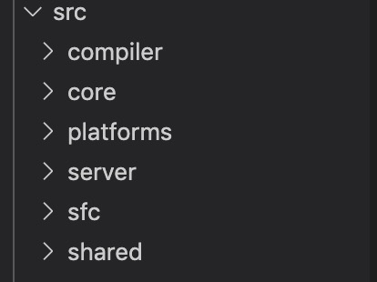
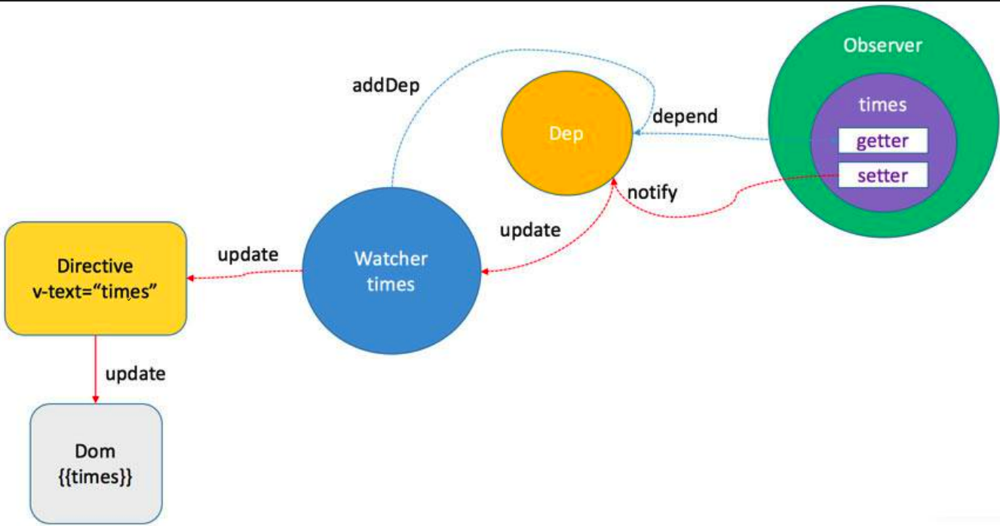

# Vue2 源码（一）

本篇文章基于 Vue2.6.12 分析

- 整体架构
- 双向数据绑定原理
- Vue 整体流程
- Vue 运行时优化

## 整体架构



- compiler: 负责编译模板
- core: Vue 核心（双向数据绑定的实现，视图更新）。
  core 里面有 components(keep-alive), global-api(.use .mixin .extend 等), instance（生命周期、事件绑定处理），observer（双向数据绑定的逻辑），util， vdom（虚拟 dom，抄的 [snabbdom](https://github.com/snabbdom/snabbdom)）
- platforms: 针对核心模块的“平台”模块，主要有 web 和 weex。
- server: 处理服务端渲染
- sfc: 处理单文件.vue
- shared: 提供全局用到的工具类

Vue 分为了运行时和编译时。Vue 既可以运行在小程序、客户端和 Web 端。运行时表现在内存中，保存当前程序运行的数据和状态。Vue 的编译分为在线编译和离线编译，所谓离线编译就是将.vue 的文件编译成 js，而在线编译是在 new Vue 时创建的时候传入的 template，走的是在线编译。在线编译会把模板编译成 with。

在线编译是 template =>js 在线编译-->js => 运行时。打包出来的 js 如果有 runtime+compiler 就是加了在线编译的。如果要做优化就要把在线编译去掉，只保留 runtime。在线编译存在的意义是做扩展。

[vue2 模板在线编译](https://vue-template-explorer.netlify.app)

```javascript
new Vue({
  data: {
    name: 1,
    b: 2,
    c: 3,
    d: 4,
  },
  template: "<div><p>{name}</p></div>",
});

// template编译之后
var _c = document.createElement;
with (this) {
  return _c("div", [_c("p", [_v(_s(name))])]);
}
```

## 双向数据绑定

- Object.defineProperty
- Observer
- Watcher
  一个模板对应一个 Watcher。
- Dep
- Directive

### Object.defineProperty

Object.defineProperty() 方法会直接在一个对象上定义一个新属性，或者修改一个对象的现有属性，并返回此对象。

```javascript
var bValue = 38;
Object.defineProperty(o, "b", {
  // 使用了方法名称缩写（ES2015 特性）
  // 下面两个缩写等价于：
  // get : function() { return bValue; },
  // set : function(newValue) { bValue = newValue; },
  get() {
    return bValue;
  },
  set(newValue) {
    bValue = newValue;
  },
  enumerable: true,
  configurable: true,
});

o.b; // 38
```

Object.defineProperty()的缺点是不能监听新增的 key，不管是对象还是数组。

```javascript
function defineReactive(data, key, value) {
  Object.defineProperty(data, key, {
    enumerable: true,
    configurable: true,
    get: function defineGet() {
      console.log(`get key:${key} value: ${value}`);
      return value;
    },
    set: function defineSet(newVal) {
      console.log(`set key: ${key} value: ${newVal}`);
      value = newVal;
    },
  });
}

function observe(data) {
  Object.keys(data).forEach(function(key) {
    defineReactive(data, key, data[key]);
  });
}

let arr1 = ["test", 2, 3];
observe(arr1);

// arr1[1] = "ddd"; // set key 1 dddd
```

为什么数组要重写 Object.defineProperty 而对象不需要？

首先来看个例子：

```javascript
// 对上面例子的数组进行unshift操作
arr1.unshift("2333");

// get key:2 value: 3
// get key:1 value: 2
// set key: 2 value: 2
// get key:0 value: test
// set key: 1 value: test
// set key: 0 value: 2333
```

数组的变更会造成频繁的移位。DOM 操作的取值会触发 get, 修改 DOM 触发 set，如果用 Object.defineProperty 监听，就会导致频繁的 get set，所以数组不能用 defineProperty 去监听。

### 重写数组的 defineProperty

1. 重写原型链 重写数组继承的对象
2. 获取到数组的原型对象
3. 基于原型对对象构建新对象
4. 定义要重写的方法（修改数组序号排序的方法）

```javascript
//重写的方法
const methodsToPatch = [
  "push",
  "pop",
  "shift",
  "unshift",
  "splice",
  "sort",
  "reverse",
];

/**
 * Intercept mutating methods and emit events
 * 遍历 重写
 */
methodsToPatch.forEach(function(method) {
  // cache original method
  // 获取该方法的原始方法
  const original = arrayProto[method];
  def(arrayMethods, method, function mutator(...args) {
    const result = original.apply(this, args);
    const ob = this.__ob__;
    let inserted;
    // 这三个方法会新增项
    switch (method) {
      case "push":
      case "unshift":
        inserted = args;
        break;
      case "splice":
        inserted = args.slice(2);
        break;
    }
    // 如果有新的项，需要重新监听
    if (inserted) ob.observeArray(inserted);
    // notify change
    // 触发视图更新，只调用一次
    ob.dep.notify();
    return result;
  });
});
```

5. 遍历方法
   a. 获取该方法的原始方法
   b.重新定义基于原型对对象构建新对象的方法
   c.执行最原始的方法

## 整体流程



1. Observer: 通过 Object.defineProperty 触发 getter 和 setter 操作。初始化的时候通过 Object.defineProperty 做数据的监听。如果触发了数据的修改和数据的获取，这个时候就能都监听到。
2. Dom 层的模板经过编译，每个模板有很多指令，一个模板对应一个 watcher。指令可以根据不同的数据渲染视图。
3. Watcher: 衔接数据和指令，指令触发视图更新。Watcher 第一次获取数据会触发 getter，getter 会告诉 Watcher 将 watcher 添加到 Dep 中。
4. Dep: 将 Watcher 存储到 Dep 中，告诉 Dep 需要订阅的数据。Observer 创建时也会添加到 Dep 中，告诉 Dep 有哪些数据可以被订阅。当数据发生修改时，会去 Dep 中找到对应的 watcher，通知更新。

总结一下；
with 执行-> 触发 get -> 收集依赖 watcher addDep
input 发生修改->触发 set 执行->notify 通知 watcher ->watcher 通知指令 更新 dom

## Observer

观察者模式是软件设计模式的一种。这种模式由一个目标对象管理所有依赖于它的观察者对象，并在它本身状态发生改变时主动发出通知。通常通过调用各观察者的方法来实现。

订阅者模式设计三个对象：发布者、主题对象和订阅者。三个对象间是一对多的关系，也就是一个发布者可以有多个订阅者。每当主题对象发生改变时，相关依赖都会得到通知并自动更新。
