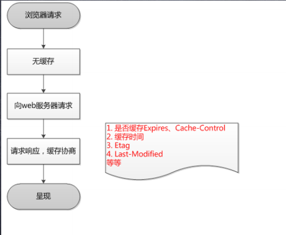
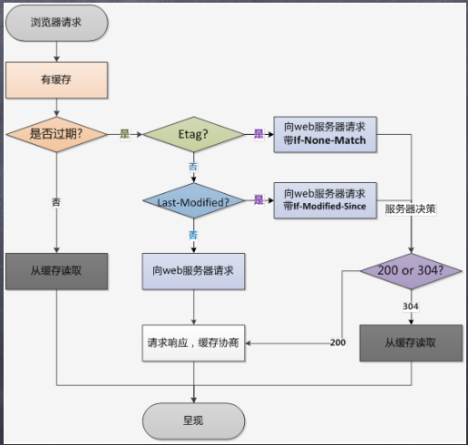

# Http的缓存机制
网络请求是非常耗时的操作，js太大或者网络不好时容易出现长时间的白屏。使用Http的缓存机制可以有效减少延迟，减少网络带宽消耗。

Http缓存分为两种，强缓存和协商缓存。

协商缓存不管是否生效，都需要与服务端发生交互。

## 强缓存
强缓存直接从本地副本比对读取，返回的状态码是 200。强缓存如果生效，不需要再和服务器发生交互。

强缓存主要包括 `Expires`和`Cache-Control`。

### Expires
Expires的值为服务端返回的到期时间，即下一次请求时，请求时间小于服务端返回的到期时间，直接使用缓存数据。
Expires是HTTP/1.0中定义的缓存字段，它有个大问题：客户端和服务端的时间可能快慢不一致，并且客户端的时间是可以自行修改的，所以这个字段不一定能满足预期
于是HTTP 1.1 的版本中使用Cache-Control替代。

### Cache-Control

Cache-Control 常见的取值有private、public、no-cache、max-age，no-store，默认为private。
- private:             客户端可以缓存
- public:              客户端和代理服务器都可缓存（前端的同学，可以认为public和private是一样的）
- max-age=xxx:   缓存的内容将在 xxx 秒后失效
- s-maxage 代理服务器缓存有效时间
- no-cache:          需要使用对比缓存来验证缓存数据（后面介绍）
- no-store:           所有内容都不会缓存，强制缓存，对比缓存都不会触发
```javascript
cache-control: public, max-age=3600, s-maxage=3600(代理服务器) 
```
当Expires和Cache-Control同时存在时，Cache-Control的优先级更高。

强缓存对于时间限制的太死，前端中一般只有一些长时间不用更新基础库（如jq）才会使用。对于更新频繁一点的，需要使用协商缓存。

## 协商缓存
协商缓存需要进行比较判断是否可以使用缓存。
浏览器第一次请求数据时，服务器会将缓存标识与数据一起返回给客户端，客户端将二者备份至缓存数据库中。
再次请求数据时，客户端将备份的缓存标识发送给服务器，服务器根据缓存标识进行判断，判断成功后，返回304状态码，通知客户端比较成功，可以使用缓存数据。

既然协商缓存还是向服务器发起了请求，我们为什么还要用协商缓存？原因是，服务端在进行标识比较后，只返回header部分，通过状态码通知客户端使用缓存，不再需要将报文主体部分返回给客户端，报文大小和请求时间都会大大减少。

协商缓存一共有两对，`Last-Modified  /  If-Modified-Since`和 `Etag  /  If-None-Match`。

### Last-Modified  /  If-Modified-Since
Last-Modified: 服务器在响应请求时，告诉浏览器资源的最后修改时间。

If-Modified-Since:再次请求服务器时，通过此字段通知服务器上次请求时，服务器返回的资源最后修改时间。
服务器收到请求后发现有头If-Modified-Since 则与被请求资源的最后修改时间进行比对。
若资源的最后修改时间大于If-Modified-Since，说明资源又被改动过，则响应整片资源内容，返回状态码200；
若资源的最后修改时间小于或等于If-Modified-Since，说明资源无新修改，则响应HTTP 304，告知浏览器继续使用所保存的cache。

### Etag  /  If-None-Match
这对的优先级高于Last-Modified  /  If-Modified-Since

Etag: 服务器响应请求时，告诉浏览器当前资源在服务器的唯一标识（生成规则由服务器决定）。
If-None-Match：再次请求服务器时，通过此字段通知服务器客户段缓存数据的唯一标识。
服务器收到请求后发现有头If-None-Match 则与被请求资源的唯一标识进行比对，
不同，说明资源又被改动过，则响应整片资源内容，返回状态码200；
相同，说明资源无新修改，则响应HTTP 304，告知浏览器继续使用所保存的cache。

缓存示意图1：




## 如何配置

后端一般都会用nginx做反向代理，缓存配置一般也在nginx中配置。
- Cache-Control
```shell
#例1：给js css设置cache-control
location ~ .*\.(js|css)$ {
    expires 10d;
}
```

- Last-Modified
Last-Modified默认也会带上，但是要配合Cache-Control使用

- Etag
nginx默认会开启etag。如果要关闭可以配置：

```shell
    etag off; 
```


1. 上线时的配置业务js
```shell
    gzip on;
    etag on;
```

2. 图片
```javascript
    location ~\.(gif|jpg|jpeg|png|bmp|ico)$ {
        root /var/www/img/;
        expires 30d;
    }

```


