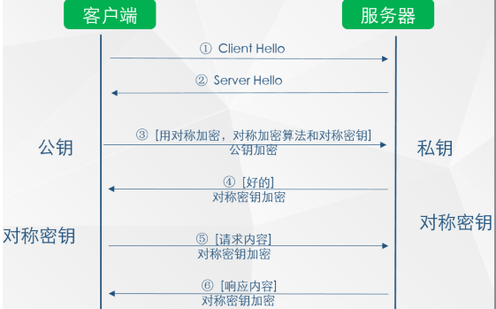
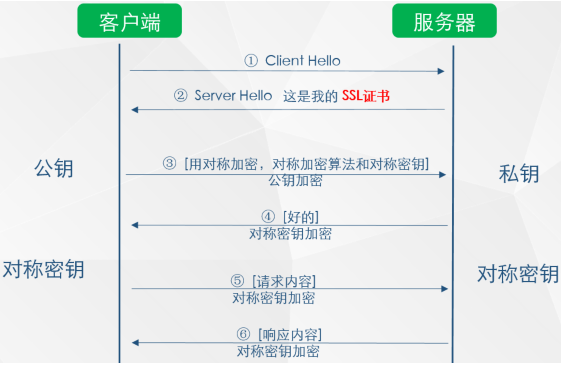
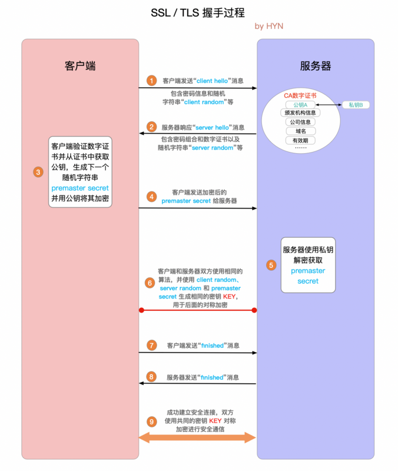

# Https
HTTPS（全称：HyperText Transfer Protocol over Secure Socket Layer），它是浏览器与Web服务器之间的应用层通信协议。

HTTPS可以理解为HTTP+SSL/TLS。SSL协议是由网景公司研发的位于TCP/IP协议与各种应用层协议之间，为数据通信提供安全支持的一种协议。

TSL（Transport Layer Security）：前身是SSL，它最初的几个版本（SSL 1.0、SSL 2.0、SSL 3.0）由网景公司开发，93年3.1版本开始被IETF标准化并改名，发展至今已经有TLS1.0、TLS1.1、TLS1.2。

## 加密算法
### 对称加密
加密和解密都使用同一个密钥，有流式和分组两种。

1. 工作过程
发送方使用密钥将明文数据加密成密文，然后发送出去。接收方收到密文后，使用同一个密钥将密文解密成明文。

2. 优点
加解密计算量小，速度快

3. 缺点
- 密钥传输问题。如何把密钥安全的传递到解密者手里？客户端如果把密钥存储在本地是不可取的，因为客户端被反编译之后，密钥容易泄露。实际中，一般是客户端向服务端请求对称加密的密钥，密钥还要用非对称加密加密之后再传输。

- 密钥管理问题。当客户端数量增多，所有客户端使用同一个密钥，容易造成密钥泄露。如果为每个客户端生成一个密钥，这样的管理成本也很大。

4. 常用的对称加密算法
DES， AES-GCM, ChaCha20-Ploly1305等

### 非对称加密
加密的密钥和解密的密钥不同，分为公钥和私钥。

1. 优点
公钥和算法公开，这样每个客户端都能用（黑客也能拿到公钥）。私钥保密,安全性高。

既然非对称加密算法安全性这么高，那我们全部用非对称加密行吗？答案肯定是不行的。凡事都有两面性。

2. 缺点
- 非对称加密算法计算量大，性能低，能够加密的数据长度有限。以RSA算法为例，它的密钥有256/512/1024/2048/4096等不同的长度。长度越长，密码强度越大，当然计算速度也越慢。使用512bit的RSA加密时，明文长度不能超过53字节，使用1024bit的RSA加密时，明文长度不能超过117字节

- 只使用非对称加密不能防止劫持。由于公钥是公开的，如果黑客拿到公钥和私钥加密后的内容，那么也可以使用公钥解密获取其中的内容。

3. 常用非对称加密算法
RSA, DSA, ECDSA, DH, ECDHE

### 哈希算法
将任意长度的信息转换为较短的固定长度的值，通常其长度要比信息小得多，且算法不可逆。

例如：MD5、SHA-1、SHA-2、SHA-256 等

### 数字签名
签名就是在信息的后面再加上一段内容（信息经过hash后的值），可以证明信息没有被修改过。hash值一般都会加密后（也就是签名）再和信息一起发送，以保证这个hash值不被修改。

## 怎么加密？
对称加密和非对称加密各有优缺点，我们可以结合两者的优点进行加密：

如上图所示

（1）第3步时，客户端把后续使用的加密方式、加密算法和对称加密密钥组成文文，用公钥加密后发给服务器。
（2）服务器收到信息后，用私钥解密，提取出对称加密算法和对称密钥后，服务器说：（好的）对称密钥加密

（3）后续两者之间信息的传输就可以使用对称加密的方式了

这里存在两个问题
1. 客户端怎么获得公钥。
（1）提供一个下载公钥的地址，会话前让客户端下载。但是下载地址有可能是假的，每次会话前下载也很麻烦。
（2）会话前，服务器把公钥发给客户端。如果黑客冒充服务器，发送给客户端一个假的公钥，也有问题。

2. 如何确认服务器是真实的而不是黑客。黑客可以伪造

### 解决办法
使用SSL证书。

如上图所示，在第 2 步时服务器发送了一个SSL证书给客户端，SSL 证书中包含的具体内容有：证书的发布机构CA;证书的有效期;公钥;证书所有者;签名等。

客户端接收到服务端发来的SSL证书时，会对证书的真伪进行校验。以浏览器为例说明如下：

1. 首先浏览器读取证书中的证书所有者、有效期等信息进行一一校验。
2. 浏览器开始查找操作系统中已内置的受信任的证书发布机构CA，与服务器发来的证书中的颁发者CA比对，用于校验证书是否为合法机构颁发。
3. 如果找不到，浏览器就会报错，说明服务器发来的证书是不可信任的。
4. 如果找到，那么浏览器就会从操作系统中取出 颁发者CA 的公钥，然后对服务器发来的证书里面的签名进行解密。
5. 浏览器使用相同的hash算法计算出服务器发来的证书的hash值，将这个计算的hash值与证书中签名做对比。
6. 对比结果一致，则证明服务器发来的证书合法，没有被冒充.
7. 此时浏览器就可以读取证书中的公钥，用于后续加密了

所以通过发送SSL证书的形式，既解决了公钥获取问题，又解决了黑客冒充问题

## TLS协议
TLS协议可以为通信双方提供识别和认证通道，从而保证同心度额机密性和数据完整性。TLS握手的过程类似于TCP建立连接时的三次握手，在握手过程中，通信双方相互验证，相互确认，并确立他们所要使用的加密算法一级会话密钥（对称加密密钥）。

1. "ClientHello" 客户端通过发送"client hello"消息向服务器发起握手请求，该消息包含了客户端所支持的 TLS 版本和密码组合以供服务器进行选择，还有一个"client random"随机字符串。

2. "Server Hello": 服务器发送"server hello"消息对客户端进行回应，该消息包含了数字证书，服务器选择的密码组合和"server random"随机字符串。

3. 验证：客户端对服务器发来的证书进行验证，确保对方的合法身份，验证过程可以细化为以下几个步骤：
- 检查数字签名
- 验证证书链 (这个概念下面会进行说明)
- 检查证书的有效期
- 检查证书的撤回状态 (撤回代表证书已失效)

4. "premaster secret"字符串：客户端向服务器发送另一个随机字符串"premaster secret (预主密钥)"，这个字符串是经过服务器的公钥加密过的，只有对应的私钥才能解密。

5. 使用私钥：服务器使用私钥解密"premaster secret"。

6. 生成共享密钥：客户端和服务器均使用 client random，server random 和 premaster secret，并通过相同的算法生成相同的共享密钥 

7. 客户端就绪：客户端发送经过共享密钥 KEY 加密过的"finished"信号。

8. 服务器就绪：服务器发送经过共享密钥 KEY 加密过的"finished"信号。

9. 达成安全通信：握手完成，双方使用对称加密进行安全通信。