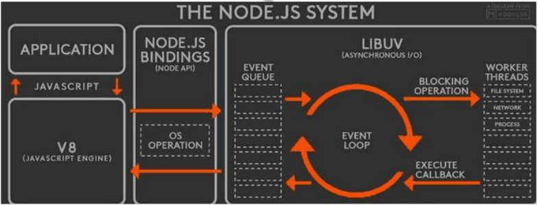
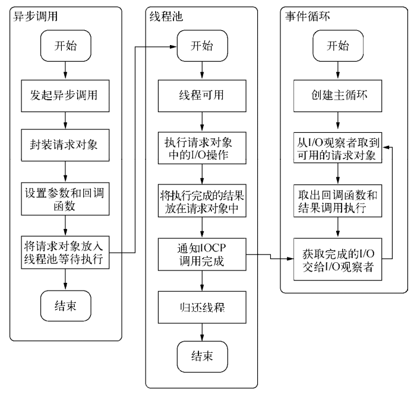
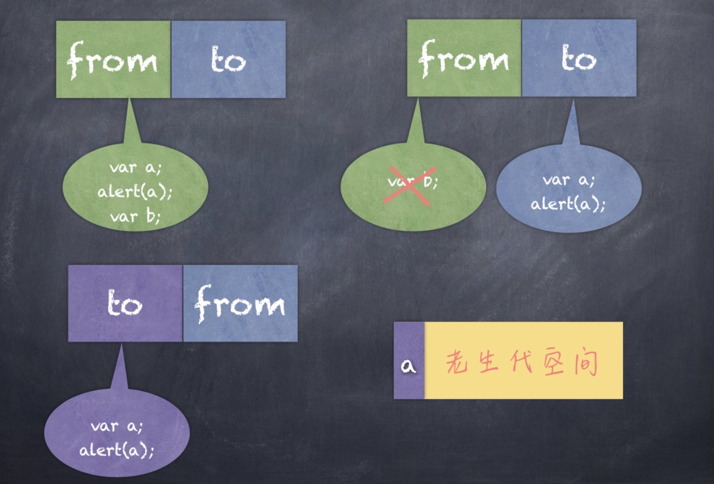
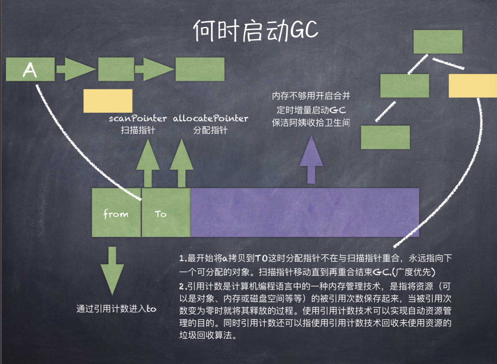
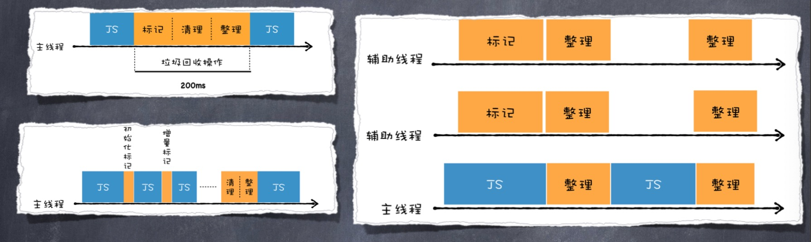
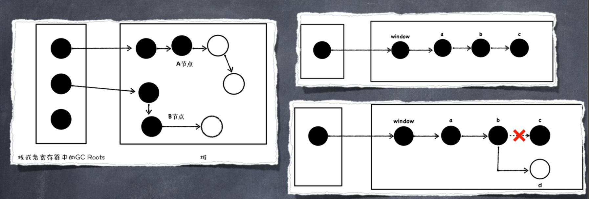
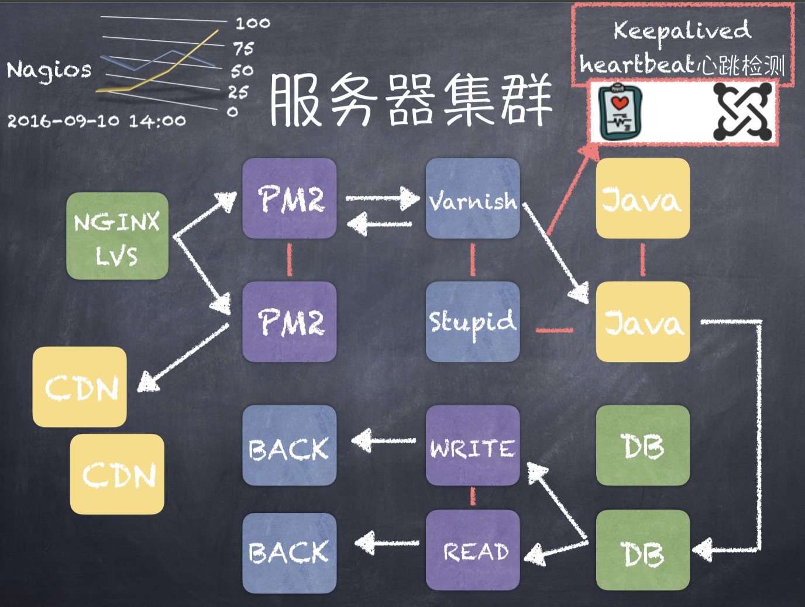

# Nodejs 初探

## Nodejs 异步 IO 原理浅析及优化方案

### 异步 IO 的好处

- 前端通过异步 IO 消除 UI 阻塞
- 并发请求耗时短
- I/O 是昂贵的，分布式 I/O 是更昂贵的
- Nodejs 适用于 IO 密集型，不适用 CPU 密集型。适用于 IO 密集型是因为 nodejs 是异步的，不适用 CPU 密集型是因为 nodejs 是单线程的。

异步 IO 虽然好，但也不是所有的东西都用异步就好，同步和异步有一个平衡点。

### Nodejs 对异步 IO 的实现

完美的异步 IO 应该是应用程序发起非阻塞调用，无需通过遍历等方式轮询。


1. application 是我们写的应用
2. V8：用来解析、执行 js 代码的运行环境。
3. node bindings: nodejs 程序的 main 函数入口。这一层由 C++编写，是 js 与底层 C/C++沟通的桥梁。
4. libuv:管理异步 IO，封装了自定义的线程池。

异步 IO 的流程：


### 宏任务和微任务

异步任务分为宏任务和微任务。
能够触发宏任务的操作有：

- script 整体代码
- I/O 操作（网络、读文件等）
- setTimeout
- setInterval
- UI rendering(js 绑定事件等)

触发微任务的操作有：

- Promise
- Objct.observe
- MutationObserver
- process.nextTick

这些任务的优先级如下：
同步任务执行 > idle 观察者 > Promise.then > io 观察者 > check 观察者

### 宏任务与微任务的执行顺序

在 Node11 之前 Node 的宏任务微任务执行顺序不一样，在 Node11 之后就是一样的。

顺序为： 初始宏任务(js 的执行) -> 执行所有的微任务 -> 执行下一个宏任务 -> 所有的微任务。

```javascript
console.log("js脚本");
setTimeout(function() {
  console.log("timeout1:宏任务");
  new Promise(function(resolve, reject) {
    resolve();
  }).then(() => {
    console.log("promise1:微任务");
  });
  new Promise(function(resolve, reject) {
    resolve();
  }).then(() => {
    console.log("promise2:微任务");
  });
});

new Promise(function(resolve, reject) {
  resolve();
}).then(() => {
  console.log("promise3:微任务");
});

process.nextTick(function() {
  console.log("nextTick1:微任务");
});

setTimeout(function() {
  console.log("timeout2:宏任务");
});

new Promise(function(resolve, reject) {
  resolve();
}).then(() => {
  console.log("promise4:微任务");
});
```

输出结果：

```javascript
js脚本;
nextTick1: 微任务;
promise3: 微任务;
promise4: 微任务;
timeout1: 宏任务;
promise1: 微任务;
promise2: 微任务;
timeout2: 宏任务;
```

### 几个特殊的 API

这几个 API 线程池不参与。

- setTimeout 和 setInterval
- process.nextTick()。实现类似 setTimeout(function(){}, 0)。每次放入队列中，在下一个循环中取出。
- setImmediate()。比 process.nextTick()优先级低。

这几个不受 event loop 管，那谁负责？Nodejs 中有三个观察者：idle 观察者，IO 观察者和 check 观察者。idle 观察者负责 process.nextTick(), IO 观察者负责 setTimeOut(), check 观察者负责 setImmdiate()。

### 实现一个 sleep

```javascript
function sleep(ms) {
  return new Promise((resolve) => setTimeout(resolve, ms));
}

async function test() {
  console.log("hello");
  await sleep(1000);
  console.log("world");
}

test();
```

### 函数式编程在 Node 中的应用

1. 高阶函数：将函数作为输入或者返回值，形成一种后续传递风格的结果接收方式，而非单一的返回值形式。后续传递风格的程序将函数业务重点从返回值传递到回调函数中。
   如：

```javascript
app.use(function(){//todo});
var emitter = new events.EventEmitter;
emitter.on(function*(){});
```

2. 偏函数：指定部分函数产生一个新的定制函数的形式就是偏函数。Node 中异步编程非常常见，underscore,after 变量。

### 常用 Node 控制异步技术手段

- step, wind, bigpipe, Qjs
- async, await
- Promise/Defferred
- 由于 Node 基于 V8 的原因，目前还不支持协程
- 协程相对独立，有自己的上下文，其切换由自己控制。线程的切换受系统控制。

## Nodejs 内存管理及内存优化

### V8 垃圾回收机制 1

- Node 使用 Javascript， 在服务端最大操作内存对象受到了一定的限制（堆区），64 位系统下约为 1.4GB, 栈区 32 位操作系统下是 0.7G, 新生代 64 位是 32M，32 位是 16M

```javascript
node --max-new-space-size app.js
// --max-lod-space-size
```

- Process.memoryUsage -> rss、heapTotal、heapUsed
- V8 的垃圾回收策略主要基于分代式垃圾回收机制。在自动垃圾回收的演变过程中没有一种垃圾回收算法能够胜任所有场景。V8 中内存分为新生代和老生代两代。新生代为存活时间较短对象，老生代中为存活时间较长的对象。

### V8 垃圾回收机制 2

- 目前 V8 采用了两个垃圾回收器，主垃圾回收器-Major GC - 主要负责老生代的垃圾回收，副垃圾回收器 - Minor GC--Scavenger 主要负责新生代的垃圾回收。两代的设计受到”代际假说“的影响。

- 第一个是大部分对象都是朝生夕死的。形容有些变量存活时间很短。
  第二个是不死的对象，会活的很久，比如全局的 window、DOM，webapi 等对象。

新生代和老生代的垃圾回收有各自的策略：

### 新生代垃圾回收

新生代垃圾回收主要通过 Scavenge 算法进行，具体实现采用了 Cheney 算法。Cheney 算法是一种采用复制的方式实现的垃圾回收算法。它将内存一分为二，每一个空间称为 semispace。这两个 semispace 一个处于使用，一个处于闲置。处于使用的称之为 From，闲置的称为 To。分配对象时先分配到 From，当开始进行垃圾回收时，检查 From 存活对象复制到 To。非存活对象被释放。然后互换位置。再次进行回收，发现被回收过直接晋升到老生代，或者发现 To 空间已经使用了超过 25%。



它的缺点是只能使用堆内存的一半，这是一个典型的空间换时间的办法，但是新生代声明周期较短，很适合这个算法。

### 老生代垃圾回收

老生代主要采用 Mark-Sweep 和 Mark-Compact。使用 Scavenge 不合适，一个是对象较多需要赋值量太大，二是没能解决空间问题。

Mark-Sweep 是标记清除，标记那些死亡的对象然后清除。但是清除之后会出现内存不连续的情况。所以要使用 Mark-Compact。

Mark-Compact 是基于 Mark-Sweep 演变而来，它先将活着的对象移到一边，移动完成后，直接清理边界外的内存。当 CPU 空间不足时会非常的高效。

V8 后续还引入了延迟处理、增量处理，计划引入并行标记处理。

### 什么时候启动 GC

如下图所示，在新生代中有两个指针，扫描指针和分配指针。最开始扫描指针和分配指针重叠。然后扫描指针采用广度优先的方式遍历 GC_ROOT，不停地拷贝对象到 To。

老生代中只有一个指针扫描老生代空间，通过标记清除合并方法管理资源。浏览器的 Memory 快照中的 distance 就是引用计数清除的依据。



垃圾回收是通过扫描 GC_Root(全局的 window 对象（位于每个 iframe 中）， 文档 dom 对象，存放栈上变量)标记空间中活动对象和非活动对象，从 GC_Root 对象出发，遍历 GC_Root 中的所有对象，能遍历到的是可访问的，应保证这些对象在内存中保留；通过 GC_Root 没有遍历到的对象是不可访问对象，被称为非活动对象，可能被回收。

### V8 垃圾回收执行效率

如主线程停下来 GC，会造成卡顿。V8 内部提供了并行、并发、增量等垃圾回收技术

- 并行回收。在执行一个完整的垃圾回收过程中，垃圾回收器会使用多个辅助线程来并行执行垃圾回收。
- 增量回收。垃圾回收器将标记工作分解为更小的块，并且穿插在主线程不同的任务之间执行。
- 并发回收。回收线程在执行 js 的过程，辅助线程能够在后台完成执行垃圾回收的操作。



### V8 怎么执行标记

V8 提出了三色标记法。黑色、白色和灰色。黑色表示这个节点被 GC_Root 引用到了，而且该节点的子节点都已经标记完成了。白色表示这个节点没有被访问到。如果在本轮遍历结束时还是白色，那么这块数据就会被收回。灰色表示这个节点被 GC_Root 引用到，但子节点还没被垃圾回收器标记处理，也表明目前正在处理这个节点。

为什么会有灰色？window.a={};window.a.b={};window.a.b.c={}。下图二扫描完一遍后，window.a.b=[]，导致 b 切开了，d 确实是闲置。增量垃圾回收器添加了一个约束条件：不能让黑色节点指向白色节点。写屏障机制(write-barrier)会强制将被引用的白色节点变成灰色的，这样就保证了黑色节点不能指向白色节点的约束条件。这个方法也称为强三色不变性。因为在标记结束时的所有白色对象，对于垃圾回收器来说，都是不可到达的，可以安全释放。在 V8 中每次执行如 window.a.b=value 的写操作之后，V8 会插入写屏障代码，强制将 value 这块内存标记为灰色。下一次遍历会从灰色节点开始遍历。



## 服务集群管理与 Node 集群的应用

### 上线预备流程

- 前端工程化的搭载动态文件的 MAP 分析压缩打包合并至 CDN
- 单测、压测 性能分析工具发现 bug
- 编写 nginx-conf 实现负载均衡和反向代理
- pm2 启动应用程序小流量灰度上线

### 服务器集群



## pm2 拉起进程的原理

nodejs 擅长处理 io 密集型程序，用 pm2 的 cluster 模式启动程序时，会在每个 CPU 上 fork 一个子进程。主进程监控子进程的运行，如果子进程挂了会重新拉起。

一个进程 fork 后，进程的代码、数据、文件、寄存器都会复制一遍，所以子进程也会执行下面的代码，子进程执行的时候就会启动应用服务。

```javascript
// master
var cluster = require("cluster"); //进程相关
var numCPUs = require("os").cpus().length; //获取CPU数目，返回cpu核数

if (cluster.isMaster) {
  //判断当前进程是不是主进程
  console.log(numCPUs);
  for (var i = 0; i < numCPUs; i++) {
    var worker = cluster.fork();
  }
} else {
  require("./app.js"); //不是主进程，起服务
}
```
