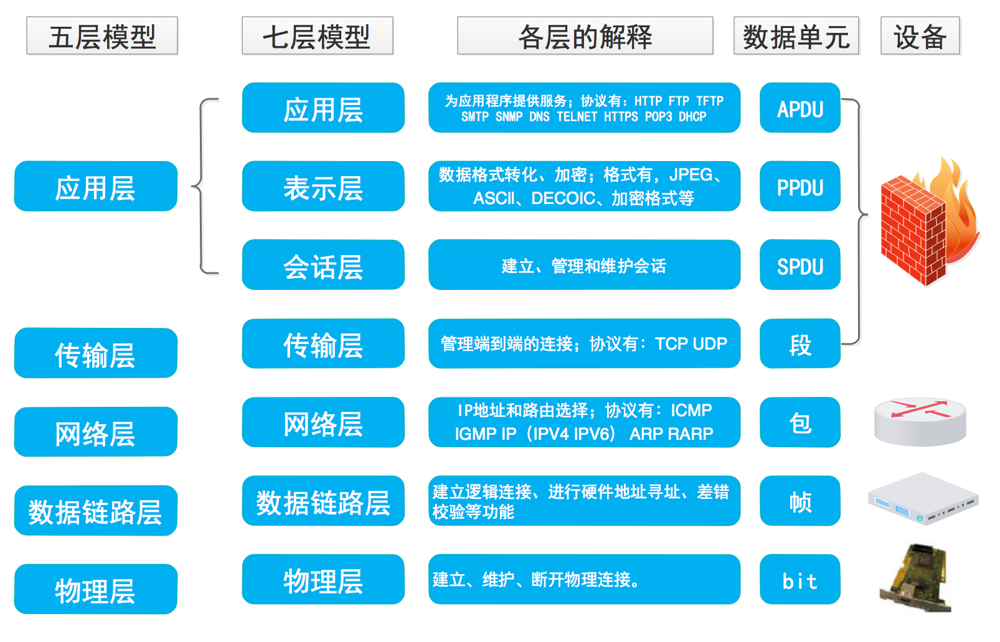
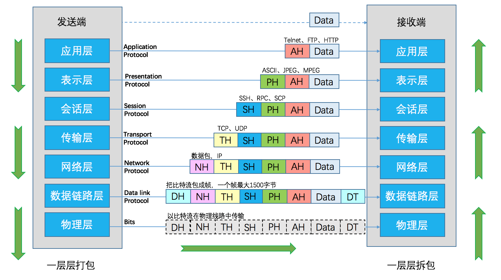
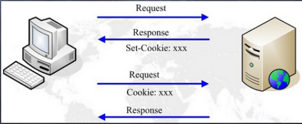
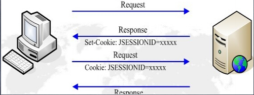

# Http 协议

Http 是超文本传输协议，它是一种通用的无状态的应用层协议。应用层定义在 OSI 七层模型中。

## OSI 七层模型

七层模型，亦称 OSI（Open System Interconnection）参考模型，是参考模型是国际标准化组织（ISO）制定的一个用于计算机或通信系统间互联的标准体系。它是一个七层的、抽象的模型体，不仅包括一系列抽象的术语或概念，也包括具体的协议。

七层模型从上到下依次是：

- 应用层：协议有：HTTP FTP(文件传输协议) TFTP SMTP(邮件传输协议) SNMP(简单网络管理协议) DNS(域名系统) TELNET(远程登录标准协议) HTTPS POP3(邮局协议) DHCP(动态主机配置协议)
- 表示层：数据的表示、安全、压缩。格式有，JPEG、ASCll、DECOIC、加密格式等
- 会话层：建立、管理、终止会话。对应主机进程，指本地主机与远程主机正在进行的会话
- 传输层：定义传输数据的协议端口号，以及流控和差错校验。协议有：TCP UDP，数据包一旦离开网卡即进入网络传输层
- 网络层：进行逻辑地址寻址，实现不同网络之间的路径选择。协议有：ICMP IGMP IP（IPV4 IPV6） ARP RARP
- 数据链路层：建立逻辑连接、进行硬件地址寻址、差错校验等功能。将比特组合成字节进而组合成帧，用 MAC 地址访问介质，错误发现但不能纠正。
  物理层：建立、维护、断开物理连接。

七层模型数据传输过程：

## Http 请求过程

以访问百度为例，当我们在浏览器输入:www.baidu.com，回车之后，发生了什么？

1. 回车后对 www.baidu.com 这个网址进行 DNS 域名解析，得到对应的 IP 地址
2. 根据 IP 找到对应的服务器，发起 TCP 的三次握手
3. 建立 TCP 连接后发起 HTTP 请求
4. 服务器响应 HTTP 请求，浏览器得到 html 数据渲染

下面详细来看看这几个过程的具体细节。

### 域名解析

域名系统（DNS）我理解为一个管理主机域名和 IP 地址的系统。DNS 是一个分布式系统，域名解析是由分布在因特网上的许多域名服务器共同完成。

DNS 规定，域名中的符号都由英文和数字组成，每一个标号不超过 63 个字符，不区分字母大小写。

域名空间：

一、主机向本地域名服务器的查询一般都是采用递归查询。所谓递归查询就是：如果主机所询问的本地域名服务器不知道被查询的域名的 IP 地址，那么本地域名服务器就以 DNS 客户的身份，向其它根域名服务器继续发出查询请求报文(即替主机继续查询)，而不是让主机自己进行下一步查询。因此，递归查询返回的查询结果或者是所要查询的 IP 地址，或者是报错，表示无法查询到所需的 IP 地址。

二、本地域名服务器向根域名服务器的查询的迭代查询。迭代查询的特点：当根域名服务器收到本地域名服务器发出的迭代查询请求报文时，要么给出所要查询的IP地址，要么告诉本地服务器：“你下一步应当向哪一个域名服务器进行查询”。然后让本地服务器进行后续的查询。根域名服务器通常是把自己知道的顶级域名服务器的IP地址告诉本地域名服务器，让本地域名服务器再向顶级域名服务器查询。顶级域名服务器在收到本地域名服务器的查询请求后，要么给出所要查询的IP地址，要么告诉本地服务器下一步应当向哪一个权限域名服务器进行查询。最后，知道了所要解析的IP地址或报错，然后把这个结果返回给发起查询的主机。

下图给出了这两种查询的差别

假定域名为m.xyz.com的主机想知道另一个主机y.abc.com的IP地址。例如，主机m.xyz.com打算发送邮件给y.abc.com。这时就必须知道主机y.abc.com的IP地址。下面是上图a的几个查询步骤：

1、主机m.abc.com先向本地服务器dns.xyz.com进行递归查询。

2、本地服务器采用迭代查询。它先向一个根域名服务器查询。

3、根域名服务器告诉本地服务器，下一次应查询的顶级域名服务器dns.com的IP地址。

4、本地域名服务器向顶级域名服务器dns.com进行查询。

5、顶级域名服务器dns.com告诉本地域名服务器，下一步应查询的权限服务器dns.abc.com的IP地址。

6、本地域名服务器向权限域名服务器dns.abc.com进行查询。

7、权限域名服务器dns.abc.com告诉本地域名服务器，所查询的主机的IP地址。

8、本地域名服务器最后把查询结果告诉m.xyz.com。

为了提高DNS查询效率，并减轻服务器的负荷和减少因特网上的DNS查询报文数量，在域名服务器中广泛使用了高速缓存，用来存放最近查询过的域名以及从何处获得域名映射信息的记录。

回到我们的例子：

### TCP三次握手
TCP是传输控制协议。
- 它提供了一种面向连接的、可靠的字节流服务。
- 在一个TCP连接中，仅有两方进行通信，广播和多播不能用于TCP。
- TCP使用校验和、确认和重传机制来保证可靠传输。
- TCP给数据分节进行排序，并使用累计确认保证数据的顺序不变和不重复
- TCP使用滑动窗口机制来实现流量控制，通过动态改变窗口的代销进行拥塞控制

三次握手示意图：

三次握手是指建立一个TCP连接时，需要客户端和服务器进行三次通信，发送3个包。
1. 第一次握手([SYN], Seq = x)
客户端发送一个SYN标记的包，Seq初始序列号，发送完成后客户端进去SYN_SEND状态。

2. 第二次握手([SYN, ACK], Seq = y, ACK = x + 1)
服务器返回确认包（ACK）应答，同事还要返回一个SYN包回去。ACK = x + 1 表示确认能收到客户端发来的请求。Seq = y 表示让客户端确认是否能收到。发送完成后服务端进入SYN_RCVD状态。

3. 第三次握手([ACK], ACK = y + 1)
客户端再次发送确认包（ACK）， ACK = y + 1 表示确认收到服务器的包。客户端发送完毕后，进入ESTABLISHED状态，服务端收到这个包也进入ESTABLISHED状态， TCP握手结束。

### 四次挥手
TCP的断开需要发送四个包，称为四次挥手。
四次挥手示意图：

1. 第一次挥手（[FIN], Seq = x）
客户端发送一个FIN标记的包，告诉服务器需要关闭连接，表示自己不用发送数据了，但是还可以接收数据。发送完成后，客户端进入FIN_WAIT_1状态。

2. 第二次挥手([ACK], ACK = x + 1)
服务端收到请求后，发送一个ACK的确认包，告诉客户端接收到关闭的请求，但是还没有准备好。发送完成后服务端进入CLOSE_WAIT状态，客户端收到这个包后进入FIN_WAIT_2，等待服务器关闭连接。

3. 第三次挥手([FIN], Seq = y)
服务器准备好关闭连接时，发送FIN标记的包，告诉客户端已经准备好可以关闭了。发送完成后，服务端进入LAST_ACK状态，等待客户端确认。

4. 第四次挥手([ACK], ACK = y + 1)
客户端接收到服务端的关闭请求，发送ACK标记的包， 进入TIME_WAIT状态，等待服务端可能请求重传ACK包。服务端接收到ACK包后，关闭连接，进入CLOSE状态。

## Http请求特点
1. 简单快速：客户向服务器请求服务时，只需传送请求方法和路径。
2. 灵活：HTTP允许传输任意类型的数据对象。正在传输的类型由Content-Type加以标记。
3. 无连接：无连接的含义是限制每次连接只处理一个请求。服务器处理完客户的请求，并收到客户的应答后，即断开连接。采用这种方式可以节省传输时间。
4. 无状态：HTTP协议是无状态协议。无状态是指协议对于事务处理没有记忆能力。缺少状态意味着如果后续处理需要前面的信息，则它必须重传，这样可能导致每次连接传送的数据量增大。另一方面，在服务器不需要先前信息时它的应答就较快。

## 状态码
状态代码一般由三位数字组成，第一个数字定义了响应的类别，共分五种类别:

- 1xx：指示信息--表示请求已接收，继续处理
- 2xx：成功--表示请求已被成功接收、理解、接受
- 3xx：重定向--要完成请求必须进行更进一步的操作
- 4xx：客户端错误--请求有语法错误或请求无法实现
- 5xx：服务器端错误--服务器未能实现合法的请求

## cookie和session
### 定义及工作原理

- **cookie**
Cookies是保存在客户端的小段文本，随客户端点每一个请求发送该url
下的所有cookies到服务器端。

- **session**
Session则保存在服务器端，通过唯一的值sessionID来区别每一个用
户。SessionID随每个连接请求发送到服务器，服务器根据sessionID来识
别客户端，再通过session 的key获取session值。

#### cookie工作过程
1. 浏览器端第一次发送请求到服务器端
2. 服务器端创建Cookie，该Cookie中包含用户的信息，然后将该Cookie发送到浏览器端
3. 浏览器端再次访问服务器端时会携带服务器端创建的Cookie
4. 服务器端通过Cookie中携带的数据区分不同的用户

#### session工作过程
1. 浏览器端第一次发送请求到服务器端，服务器端创建一个Session，同时会创建一个特殊的Cookie（name为JSESSIONID的固定值，value为session对象的ID），然后将该Cookie发送至浏览器端
2. 浏览器端发送第N（N>1）次请求到服务器端,浏览器端访问服务器端时就会携带该name为JSESSIONID的Cookie对象
3. 服务器端根据name为JSESSIONID的Cookie的value(sessionId),去查询Session对象，从而区分不同用户。
name为JSESSIONID的Cookie不存在（关闭或更换浏览器），返回1中重新去创建Session与特殊的Cookie
name为JSESSIONID的Cookie存在，根据value中的SessionId去寻找session对象
value为SessionId不存在**（Session对象默认存活30分钟）**，返回1中重新去创建Session与特殊的Cookie
value为SessionId存在，返回session对象

### 区别
- cookie数据保存在客户端，session数据保存在服务端。
- session不能伪造，cookie容易伪造。
- cookie大小受浏览器限制。一个站点在客户端存放的cookie不能超过4K。