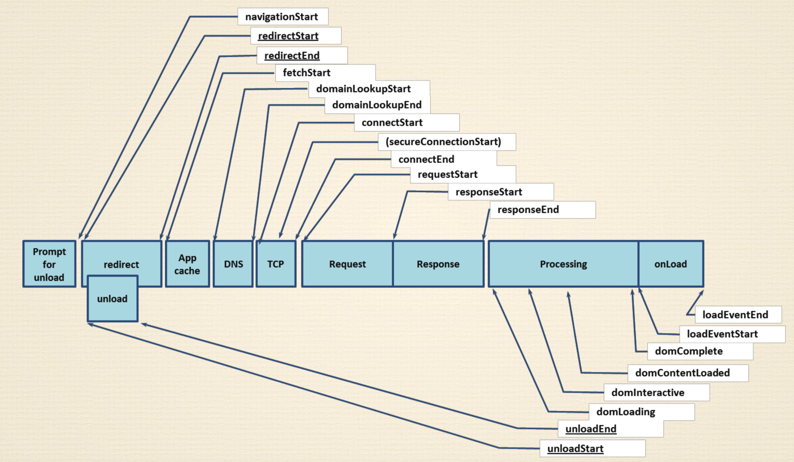
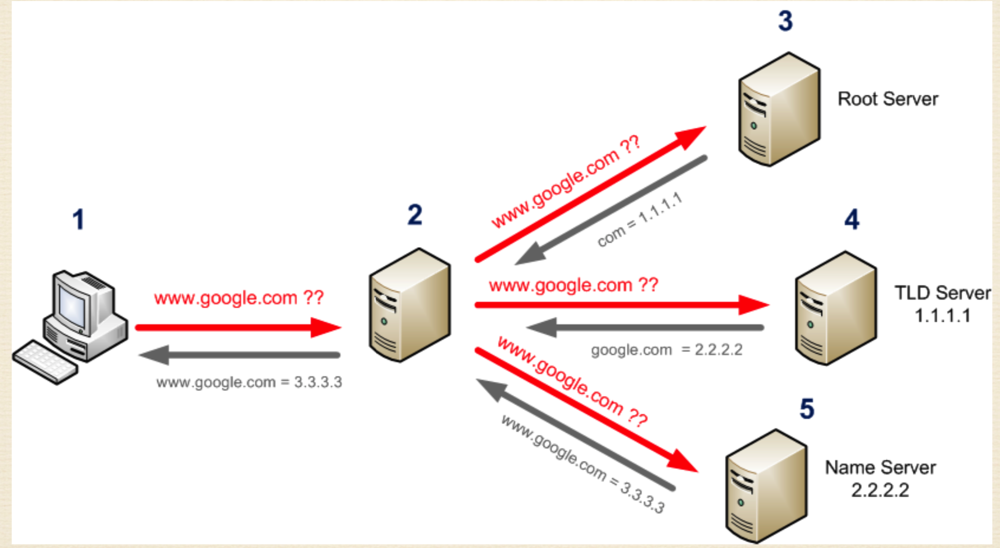
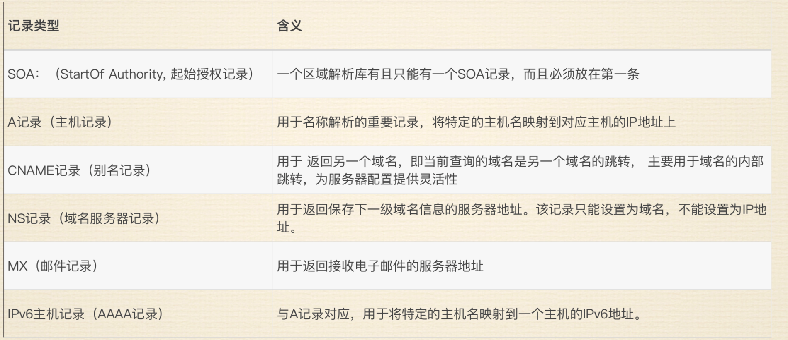

# 性能优化服务器基础知识

回顾一下 Http 的请求过程：

1. 输入网址并回车
2. 解析域名
3. 浏览器发送 HTTP 请求
4. 服务器处理请求
5. 服务器返回 HTML 响应
6. 浏览器处理 HTML 页面
7. 继续请求其它资源

整个的过程可以看下面这张 navigation-timing 图：

## Navigation Timing

:::tip
[API 参考](https://developer.mozilla.org/zh-CN/docs/Web/API/Navigation_timing_API)

[w3c](https://www.w3.org/TR/navigation-timing/)
:::

Navigation Timing API 提供了可用于衡量一个网站性能的数据。与用于相同目的的其他基于 JavaScript 的机制不同，该 API 可以提供可以更有用和更准确的端到端延迟数据。

你可以使用 Navigation Timing API 在客户端收集性能数据，并用 XMLHttpRequest 或其它技术传送到服务端。同时，该 API 使你可以衡量之前难以获取的数据，如卸载前一个页面的时间，在域名解析上的时间，在执行 load 事件处理器上花费的总时间等。

### 阶段一

1. Prompt for unload。准备把当前页面卸载。如果直接在浏览器输入网址就没有这个参数，页面内点击跳转会有。(navigation Start)
2. redirect。重定向开始。(redirectStart)
3. 重定向开始后，同时开始 unloadStart。这个 unload 是把前面的页面彻底去掉。
4. unloadEnd
5. 重定向结束。(redirectEnd)
6. 发起请求。(fetchStart)
7. App cache。如果要走本地缓存就从本地缓存去取。

### 阶段二(网络相关)

1. 查询域开始(DNS 查找)。(domainLookupStart)
2. 查询域结束。(domainLookupEnd)
3. TCP 连接开始建立。(connectStart)
4. 建立安全连接(可选)。(secureConnectStart)
5. 连接建立成功，握手/TLS 握手结束。(connectEnd)
6. 请求开始。请求结束时间只有服务器知道，浏览器是不知道的，所以没有。(requestStart)
7. 响应开始。(responseStart)
8. 响应结束。(responseEnd)
   网络阶段暂时结束。这是因为网络协议协商过程如果设置并支持了 keep-alive，连接会保持。减少 TCP 握手时间。

### 阶段三(DOM 相关)

1. DOM 解析开始。(domLoading)
2. DOM 解析完成。(domInteractive)
3. DOM 依赖加载完成。包括 CSS，JS。(domContentLoaded)。
4. 处理 DOM 事件绑定，CSS。
5. DOM 处理完成。(domComplete)
6. 如果页面绑定了 onLoad 事件，开始执行 onLoad。(loadEventStart)
7. onLoad 执行完毕。（loadEventEnd）

分析的重点应放在：DNS,TCP,Response，Processing 和 onLoad 阶段。

## DNS 详解

DNS 是 Domain Name System 域名系统，用于将域名转换为 IP。

- 顶级域名。例如 www.baidu.com。baidu.com 是顶级域名，加了 www 就是二级域名。com 是根域名。
- 域名资源记录。域名与 IP 对应的关系。
- 域名服务器。做域名解析的机器。
- 域名解析。将域名转换成 IP。IPV4 存储在计算机中是一个整数（int）。占 4 个字节。一个字节的范围是 0-255。这就是为什么 IP 地址最大是 255。IPV6 的地址长度是 128 位,相当于 1 位就有 4 个 int，32 个字节。

### DNS 解析过程

1. 当你要访问网站的时候首先要解析域名, dns 服务器收到请求之后优先从本地缓存找(高频域名),如果缓存没有(找不到),就要向根域名(Root server)服务器(全球有 13 台，中国只有镜像，所以 IPV6 诞生)去查询
2. 根域名服务器只维护后缀(com);把后缀这一类的域名拿出来之后告诉 dns 服务器这个后缀的服务器去向哪个服务器查询
3. DNS 收到这个服务器地址之后, 接着去找 TLD 服务器,它负责维护一级域名, 同样的它也干活, 返回名称服务器的 IP
4. DNS 收到 TLD 服务器返回来的名称服务器地址之后, 再去名称服务器上去查询这个域名的 IP
5. DNS 收到名称服务器返回的 ip 地址之后, 先把它丢到缓存里, 然后才会返回给客户端

::: tip 缓存算法(空间换时间)

理论上来说,什么样的数据都可以写进缓存

但是有的有必要写缓存,有的没必要写缓存,有的是临时缓存

缓存算法最重要的就是：数据命中率

数据命中率，访问有效性

如何提高这个命中率：需要去动态的维护缓存里面的数据
:::

### 记录类型

## CDN 与集群

是数据分发网络，对网络优化的一种。非 CDN 是不管客户端在地球 🌍 的任何一个角落，都要到同一台服务器去取东西。这种情况有些问题，首先服务器就一个，访问量大会造成服务器压力大。第二个问题是客户端到服务器的网络状态不好控制，比如从北京去访问美国的服务器，那中间要经过很多传输设备和很多海底电缆光缆，这个速度肯定是要慢。

所以这个时候需要给服务器建立镜像，建立若干个镜像，根据客户端的地理位置，网络结构分别放在不同的位置。一般越近越好，中间跨越的路由设备和交换设备越少越好。这就是布置镜像服务器的原则，而这些镜像服务器里边的数据都是一样的。访问的时候就会就近访问，这样一来访问速度就快，压力就小。这些服务器的 IP 是不一样的，但是要访问的时候就产生了 IP 和域名解析的问题。这个时候就需要配合 cdn，在一个区域内，cdn 分级去管理。这个区域内有内部服务器，就是名称服务器（ DNS 的名称服务器），这个时候访问的时候给返回的 IP 就是当前镜像服务器的 IP。所以在不同的区域，DNS 返回的就是自己区域内的镜像服务器的 IP。根据 IP 网段，地理位置等去返回离的最近的镜像服务器地址。这样就解决了域名的问题。镜像加上 DNS 域名解析，就构成了 DNS 的主要机制。
