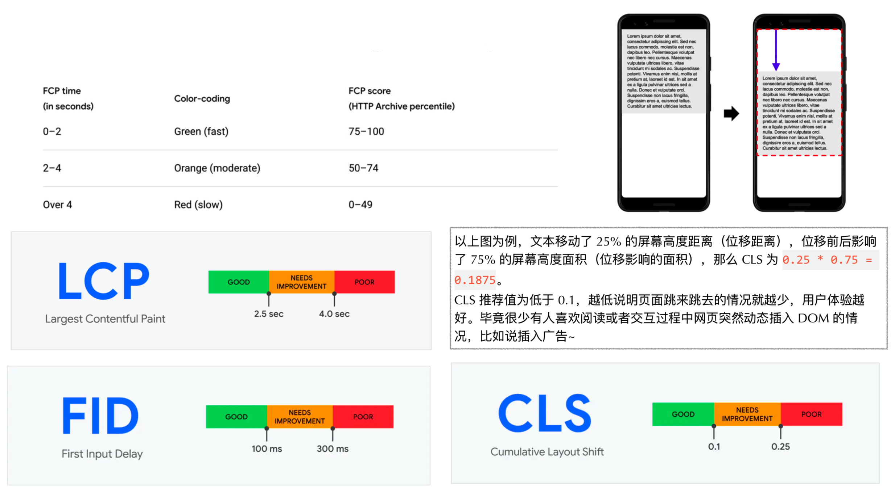
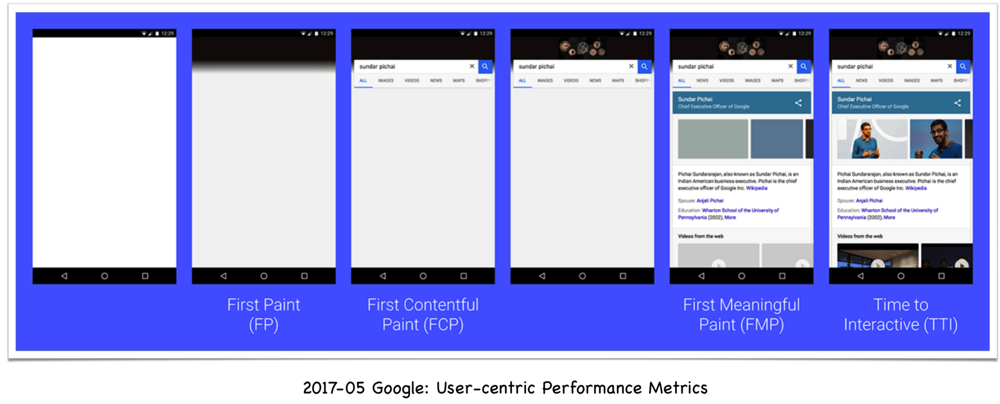
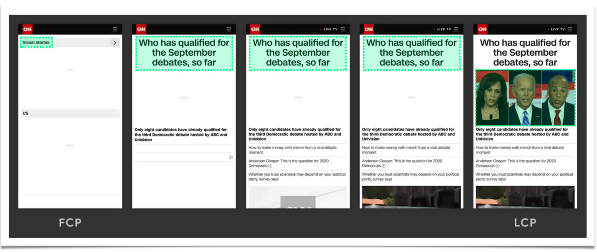
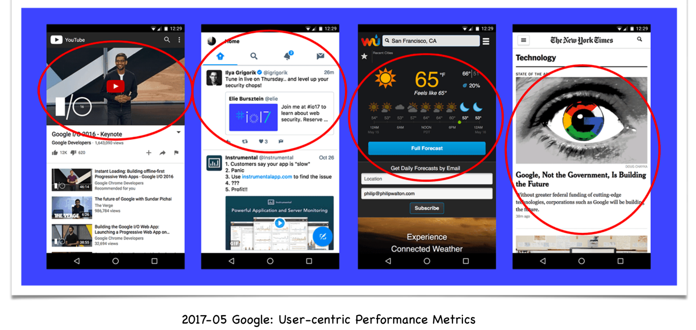
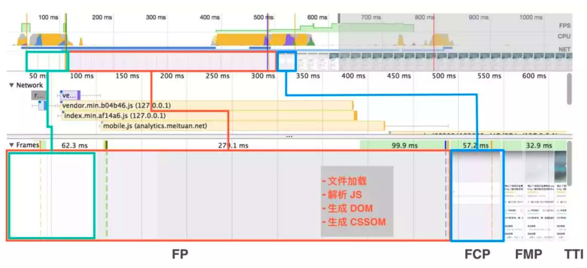
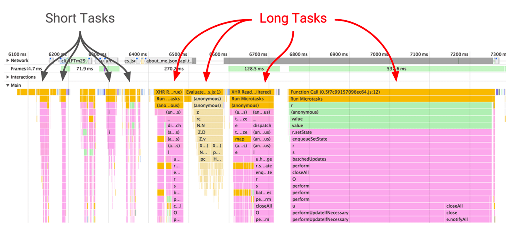
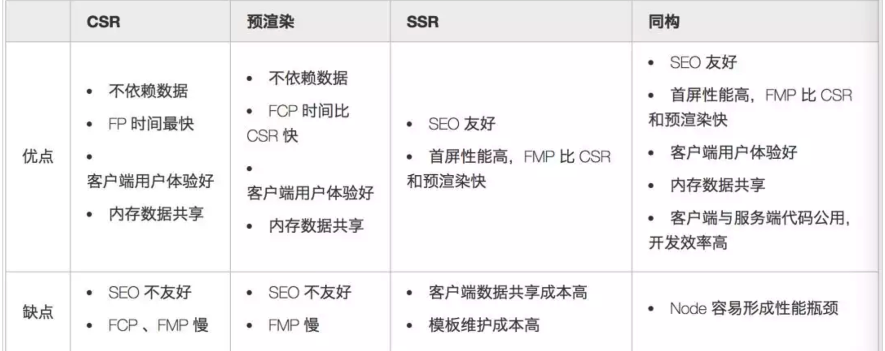

# 性能指标分析

## 指标

| 序号 | 名称       | 含义                                                                  |
| ---- | ---------- | --------------------------------------------------------------------- |
| 1    | TTFB       | Time To First Byte 首字节时间                                         |
| 2    | FP         | First Paint 首次绘制                                                  |
| 3    | FCP        | First Content Paint 首次有内容的绘制                                  |
| 4    | FMP        | First Meaningful Paint 首次有意义的绘制,争议比较大，什么是有意义      |
| 5    | TTI        | Time To Interactive 可交互时间，推荐的时间是 100ms 以内，否则有延迟感 |
| 6    | Long Tasks | 超过 50ms 的任务                                                      |

## 新加指标

| 序号 | 名称 | 含义                                                                                                                                                                           |
| ---- | ---- | ------------------------------------------------------------------------------------------------------------------------------------------------------------------------------ |
| 1    | LCP  | Largest Content Paint 用于记录视窗内最大的元素绘制时间，该时间会随着页面渲染变化而变化，因为页面中的最大元素在渲染过程中可能会发生改变，另外该指标会在用户第一次交互后停止记录 |
| 2    | FID  | First Input Delay 首次输入延迟。记录在 FCP 和 TTI 之间用户首次与页面交互时响应的延迟                                                                                           |
| 3    | TBT  | Total Blocking Time 阻塞总时间。记录在 TCP 到 TTI 之间所有长任务的阻塞时间总和                                                                                                 |
| 4    | CLS  | Cumulative Layout Shift 累计位移偏移。记录了页面上非预期的位移波动。使用按钮动态添加了某个元素，导致页面其它位置的代码发生了偏移，                                             |

LCP 代表了页面的速度指标。LCP 能体现的东西更多一些，一是指标实时更新，数据更精确。而是代表页面最大元素的渲染时间，最大元素的快速载入能让用户感觉性能还挺好。

FID 代表页面的交互体验指标。交互响应的快会让用户觉得网页流畅。

CLS 代表了页面的稳定指标，尤其在手机上这个指标更为重要。因为手机屏幕小，CLS 的值一大会让用户觉得页面体验很差。

例：


## 如何看这些指标







我们可以通过 Chrome 的面板-perfomance 查看这些参数


FP: 仅有一个 div 根节点
FCP: 包含页面的基本框架，但没有数据内容
FMP: 包含页面所有元素及数据


### long task

通过火焰图可以看到具体页面里什么有影响。



## 白屏产生原因

- CSS&JS 文件获取
- JS 文件解析
- DOM 生成
- CSSOM 生成

SPA 应用 Loading JS 的过程会导致白屏，同构应用中如果后台在做网络请求或者模板渲染过程中也会导致白屏（可以使用 bigpipe 吐流出来）。如果资源都回来了，JS 位置的摆放也会影响到 DOM 渲染。

## 如何获取这些指标

- performanceTracer Chrome插件 有点简单
- PageSpeed  Chrome插件  也不太够用
- performance.timing 专业的

```javascript
<script>
  let t = performance.timing;
  console.log(
    'DNS查询耗时 ：' + (t.domainLookupEnd - t.domainLookupStart).toFixed(0)
  );
  console.log('TCP链接耗时 ：' + (t.connectEnd - t.connectStart).toFixed(0));
  console.log(
    'request请求耗时 ：' + (t.responseEnd - t.responseStart).toFixed(0)
  );
  console.log(
    '解析dom树耗时 ：' + (t.domComplete - t.domInteractive).toFixed(0)
  );
  console.log('白屏时间 ：' + (t.responseStart - t.navigationStart).toFixed(0));
  console.log(
    'domready时间 ：' +
      (t.domContentLoadedEventEnd - t.navigationStart).toFixed(0)
  );
  console.log(
    'onload时间 ：' + (t.loadEventEnd - t.navigationStart).toFixed(0)
  );

  if ((t = performance.memory)) {
    console.log(
      'js内存使用占比 ：' +
        ((t.usedJSHeapSize / t.totalJSHeapSize) * 100).toFixed(2) +
        '%'
    );
  }
</script>

```

- PerformanceObserver

```javascript
<!DOCTYPE html>
<html lang="en">
  <head>
    <meta charset="UTF-8" />
    <meta name="viewport" content="width=device-width, initial-scale=1.0" />
    <title>Document</title>
    <style>
      body {
        background: gray;
      }
    </style>
  </head>
  <body>
    <div id="app">
      123
      <h1>京程一灯</h1>
      <script>
        performance.mark('yideng');
      </script>
    </div>
    <script>
      // for(){
      // }
      const observer = new PerformanceObserver((list) => {
        for (const entry of list.getEntries()) {
          console.log(entry.name);
          console.log(entry.startTime);
          console.log(entry.duration);
        }
      });
      observer.observe({ entryTypes: ['paint', 'mark', 'longtask'] });
    </script>
  </body>
</html>
```
在做性能监控SDK时，尽量不要使用fetch发请求。有几种方式：
1. navigator.sendBeacon()。不占并发，最合适。
2. img。 用img引一张src=1kb*1kb的图，好处是不用写数据库。1*1.png?fc=0.22。
3. ajax。比fetch好一点，但是占并发。
4. fetch。fetch优先级太高了，业务需要用到，监控上报尽量不要用这个。

- web-vitals。
如果不想自己做SDK可以使用这个库。

- tti-polyfill

### 总结


- 雅虎军规
- 渲染加载
- 页面加载
- Node加载
- 慎用缓存

## Timeline帧渲染模式
网页动画能够做到每秒60帧，就会和显示器同步刷新。1秒之内进行60次重新渲染，每次重新渲染的时间不能超过16.66ms。

Timeline中有四种颜色，分别表示：
- 蓝色：网络通信和HTML解析
- 黄色：JavaScript执行
- 紫色：样式计算和布局，即重排
- 绿色：重绘

我们知道，使用setTimeout和setIntervel的时候实际情况并不会按照我们设想的那样运行。早期的浏览器setIntervel的执行间隔是15.8ms左右，浏览器刷新的间隔是16.66ms的话，系统拿出两个15.8来执行一次刷新。js中有一个同步事件队列，也会导致不准。浏览器提供了window.requestAnimationFrame()，让我们可以在浏览器下一帧渲染的时候执行, window.requestIdleCallback，可以在下几次重新渲染时执行。这样可以让浏览器渲染效率最大化。

### 触发分层
实际的网页是分层的。网页是如何渲染的？首先获取DOM并将其分割成多个层，将每个层独立的绘制进位图中。如果GPU参与处理，渲染过程会加快，将层作为纹理上传至GPU，复合多个层来生成最终的屏幕图像。

1. DOM子树渲染层 (RenderLayer) -> RenderObject -> GraphicsContext （根元素，position（absolute relative， fix不是）, tranform, 半透明， css滤镜， Canvas2D, video，溢出都会触发RenderLayer）
2. Compositor -> 渲染层子树的图形层(GraphicsLayer) => RenderLayer -> RenderObject。Compositor将所有的拥有compositing layer进行合成，合成过程GPU参与。合成完毕就能将纹理映射到一个网络几何结构上。在视频游戏或者CAD程序中，这种技术用来给框架式的3D模型添加皮肤。Chrome采用纹理把页面中的内容分块发送给GPU，纹理能够以很低的代价映射到不同的位置，而且还能以很低的代价通过把他们应用到一个简单的矩形网格中进行变形。这就是CSS 3D的实现原理。
（什么时候会触发合成？CSS 3D透视变换,video, webgl,transform动画,加速css滤镜）

  