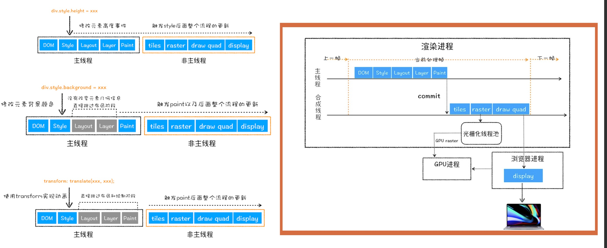

# 渲染中的性能优化

## 网页渲染过程

1. DOM 分层。通过 firefox3D 可以看到我们的网页实际上是一层一层的。DOM 分层和 z-index 属性不是一回事，后面会说到。

2. 计算样式。获取到 DOM 元素后，对 DOM 元素节点计算样式结果。 `Recalculate Style`中负责计算样式结果。计算完成之后要摆放了。

3. 重排。为每个节点生成图形位置。 `Layout`负责回流重排。

4. 重绘。将每个节点绘制填充到图层位图中。 `Paint`负责。

5. 将图层作为纹理上传到 GPU。纹理是给 GPU 传输的小的图块，可以对齐进行旋转，缩放等。

6. 合成层。 把符合图层生成到页面上。由`Composite Layers`负责。

如果能跨过重排重绘，直接进入合成层，就能提高渲染性能。

7. Composite Layers 做了什么？

​ ① 图层的绘制列表准备好之后，主线程将列表提交给合成线程

​ ② 合成线程根据当前的视口(viewport)划分图块。 256*256/512*512

③ 把图块生成位图，这个过程叫栅格化。图块转换成位图就使用了 GPU，生成的位图保存在 GPU 中。 (Raster)

④ 如果所有图块都准备完成后，合成线程会生成一个 DarwQuad 命令，提交给浏览器渲染进程。

⑤ 浏览器有一个叫 viz 的组件，这个组件接收到 DarwQuad 命令后，会根据生成的位图绘制到我们的屏幕上。

如果没有触发 GPU 操作，会在 CPU 里操作。

## 分层

1. 什么会触发元素分层？

- 根元素
- position 分层
- transform
- 半透明元素
- 设置了 css 滤镜
- canvas
- vedio
- overflow

2. 什么会让 GPU 参与进来？

- CSS3D
- video
- canvas webgl
- transform
- css 滤镜
- will-change:transform

## 重绘和重排

重排一定会导致重绘，重绘不一定导致重排。

什么情况会导致重排？

- 盒子动了。开发中会使用怪异合模型。设置 box-sizing:border-box 让盒子不往外撑。box-sizing 设置为 "border-box"，这可令浏览器呈现出带有指定宽度和高度的框，并把边框和内边距放入框中

- 读属性。
  以下属性只要一读就会立即放弃当前的优化。这是因为浏览器进行优化操作时，会把一些引起重排重绘的操作放到一个队列中，等队列到了一定数量出，再操作。如果做了如下读操作，会把这些队列中的操作全部释放，就会引起重排。

```
offset, scroll, client, width
```

如何解决这个问题？写代码过程中尽量把读操作和写操作放一起。但是实际开发过程中很难做到。怎么做呢？可以把操作放在`requestAnmationFrame()`中做读写分离。

CPU 主要负责操作系统和程序，GPU 负责显示数据处理（gpu.js）。

[css triggers 这个网站可以查看属性是否会引起重绘重排](https://csstriggers.com/)

如果我们自己不能很好的管理 dom，可以参考[fast dom](https://www.npmjs.com/package/fastdom)

## 渲染流程总结


分析 DOM，计算样式，然后执行 Layout Layer Paint，
然后提交给合成线程。合成线程分块，然后交给光栅，光栅化有一个独立的线程池，CPU 接收到 draw quad 命令后，绘制出图片。

## 打脸问题

### JS 放的位置会影响 DOM 渲染吗

如果 script 写到底下，js 还会影响 dom 的渲染吗？答案是会。浏览器会等待 js 加载。

```javascript
<!DOCTYPE html>
<html lang="en">
  <head>
    <meta charset="UTF-8" />
    <meta name="viewport" content="width=device-width, initial-scale=1.0" />
    <title>Document</title>
  </head>
  <body>
    <h1>dddd</h1>
    <script>
      // DOM解析不影响 渲染依旧等待
      prompt('等待');
    </script>
  </body>
</html>
```

那 js 放底下就没有意义了吗？有意义。放底下不影响 DOM 解析。

### CSS 会影响 DOM 解析和渲染吗

CSS 会影响 DOM 渲染，不影响 DOM 解析。在 Chrome 调试工具中设置限速，可以看到效果。

```javascript
<!DOCTYPE html>
<html lang="en">
 <head>
   <meta charset="UTF-8" />
   <meta name="viewport" content="width=device-width, initial-scale=1.0" />
   <title>Document</title>
   <style>
     h1 {
       color: red !important;
     }
   </style>
   <script>
     function h() {
       console.log(document.querySelectorAll('h1'));
     }
     setTimeout(h, 0);//验证是否影响解析
   </script>
   <link
     rel="stylesheet"
     href="https://cdn.staticfile.org/twitter-bootstrap/5.0.0-alpha1/css/bootstrap-utilities.min.css"
   />
 </head>
 <body>
   <!--
         1.css 影响DOM渲染
         2.css 不会影响DOM解析
     -->
   <h1>dddd</h1>
 </body>
</html>

```

### CSS 会影响 JS 执行吗？

直觉上不会，但真的是这样吗？

```javascript
<!DOCTYPE html>
<html lang="en">
 <head>
   <meta charset="UTF-8" />
   <meta name="viewport" content="width=device-width, initial-scale=1.0" />
   <title>Document</title>
   <style>
     h1 {
       color: red !important;
     }
   </style>
   <link
     rel="stylesheet"
     href="https://cdn.staticfile.org/twitter-bootstrap/5.0.0-alpha1/css/bootstrap-reboot.min.css"
   />
 </head>
 <body>
   <h1>ddddd</h1>
   <script>
     //css 加载会阻塞后面JS语句
     console.log('dddddd');
   </script>
 </body>
</html>

```

JS 会等待 CSS 回来，不然会引起页面抖动。

### CSS 会影响 Dom content loaded 吗

当初始的 HTML 文档被完全加载和解析完成之后，DOMContentLoaded 事件被触发，而无需等待样式表、图像和子框架的完全加载。

```javascript
<!DOCTYPE html>
<html lang="en">
  <head>
    <meta charset="UTF-8" />
    <meta name="viewport" content="width=device-width, initial-scale=1.0" />
    <title>Document</title>
    <script>
      document.addEventListener('DOMContentLoaded', function () {
        console.log('DOMContentLoaded');
      });
    </script>
    <link
      rel="stylesheet"
      href="https://cdn.staticfile.org/twitter-bootstrap/5.0.0-alpha1/css/bootstrap-reboot.min.css"
    />
    <script>
      console.log('acss');
    </script>
  </head>
  <body>
    <h1>京程一灯</h1>
  </body>
</html>

//这里DOMContentLoaded会阻塞

```

答案是有时候影响有时候不影响。什么时候影响？什么时候不影响？

影不影响取决于 css 下面还有没有脚本。如果 css 下面有脚本，那么就会阻塞，否则不会阻塞。为什么有脚本就会阻塞。这是因为脚本可以操作 DOM，加载 CSS 的时候不知道下面的脚本会不会影响 DOM，所以就要一直等着。
