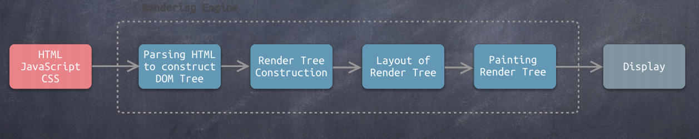
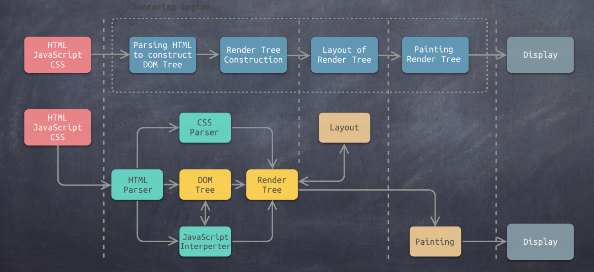
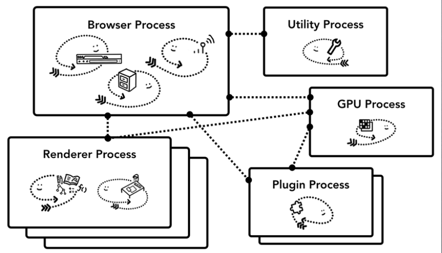
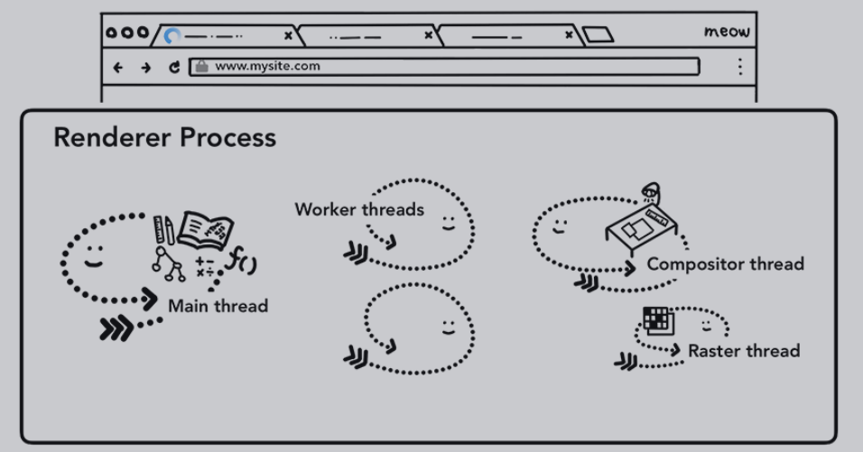
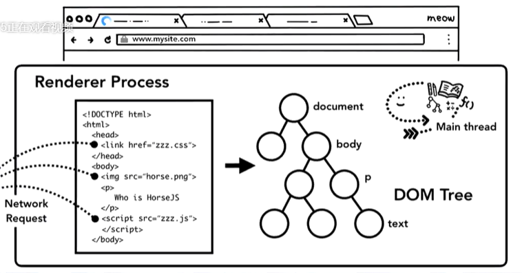
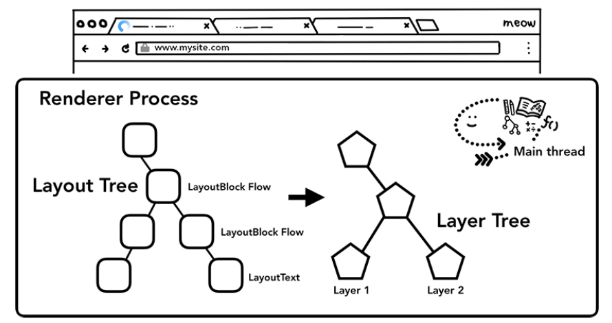
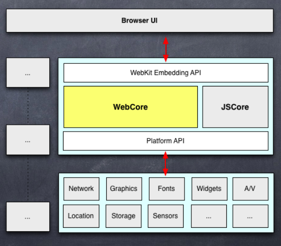

# Chrome浏览器渲染机制
## 现代浏览器的结构
- 用户界面 
- 浏览器引擎。加载url，处理前进后退刷新等操作。同时还提供了很多hooks,帮助查看加载进度。
- 渲染引擎。主要负责页面可视化，它需要处理HTML和XML。XML是一种结构化文档。XML太重，解析很耗资源。XML解析手段有两种，一种是DOM解析，一种是SAX解析。DOM解析是完全按照节点结构在内存中生成DOM树。 SAX根据语义解析，不生成DOM，但是SAX处理方式太简单，不能满足复杂需求。浏览器的文档是比较复杂的，所以用的是DOM解析。渲染引擎还负责CSS的处理。CSS和DOM配合起来，会生成渲染树。渲染引擎还负责嵌入页面，计算页面布局。

- 网络。
- JS解释器。在Google Chrome中是V8，在Safiri中是JS Core。
- XML解析器
- 显示后端。负责界面绘图和显示的基本操作，字体、窗口等。
- 数据持久层。把内存的数据保存到硬盘中。

## 常见的渲染引擎
渲染引擎能够将HTML/CSS/JS文本及相应的资源文件转换成图像结果。
- IE、Edge（旧）：Trident
- Firefox: Gecko
- Safari: Webkit
- Chromium/Chrome, Opera, Edge(新): Blink(Webkit fork)

## 渲染引擎结构与工作流程
渲染引擎以HTML/JS/CSS等文件作为输入，以可视化内容作为输出

渲染引擎内部主要做四步：
1. 将HMTL初始化解析成DOM树，HTML参与。
2. 生成渲染树。需要CSS参与
3. 对渲染树进行布局。
4. 绘制渲染树。

下图是每步对应的内容。渲染引擎中两个核心的数据结构就是DOM树和渲染树，还有2个解析器，HTML解析器和CSS解析器，还有一个JS解释器。

上面有个注意的地方，JS解释器和DOM树是有关系的。 JS有document对象，可以直接操作DOM，改变DOM结构。同时JS也可以读取DOM数据。DOM树修改了，渲染树需要重新生成。

## Chrome架构

Chrome里有一个主进程，就是Browser Process，其他的都是子进程。主进程负责状态栏，文件，网络等。Utility进程是辅助主进程，Renderer进程就是渲染进程。插件进程不管扩展。GPU进程用来做展示部分。

- Browser: 控制程序的"Chrome"部分，包括地址栏，书签，后退和前进按钮。还处理Web浏览器的不可见的，和特权部分，例如网络请求和文件访问。
- Renderer: 负责显示网站的选项卡内所有内容
- Plugin: 控制网站使用的所有插件，例如Flash。
- GPU: 独立于其他进程的GPU处理任务。它被分成多个不同的进程，因为GPU处理来自多个程序的请求并将它们绘制在同一个面中。

### 渲染进程
渲染进程负责选项卡内发生的所有事情。在渲染进程中，主线程处理你为用户编写的大部分代码。

如果使用了Web Worker 或 Service Worker，有时JS代码的一部分将由工作线程处理。排版和栅格线程也在渲染器进程内运行，以便高效、流畅地呈现页面。

### 渲染过程-解析部分

1. 构建DOM。
2. 子资源加载，如果发现有css png等资源，会同时加载。注意js可以阻止解析。当扫描到js时，DOM构建会暂停，会先去执行js。
3. 提示浏览器如何加载资源
4. 样式表计算  ---->生成了渲染树
5. 布局
6. 绘制

### 渲染过程-合成部分
光栅化把文档的结构、元素的样式、几何形状和绘制顺序转换为屏幕上的像素。

合成部分就是将页面的各个部分分层，分别栅格化，并在一个被称为合成器线程的独立线程中合成为页面的技术。

### 渲染过程- GPU渲染
GPU会把整个页面划分成若干个块(tile)，GPU是一个tile一个tile处理。为啥？这和GPU的结构有关系。CPU什么事情都能做，擅长做整数运算。但是处理图形的时候是浮点运算。GPU是众核处理器(超过48个)。GPU核简单，擅长处理浮点运算。

一旦创建了层树并确定了绘制顺序，主线程就会将该信息提交给合成器线程。合成器线程然后栅格化每个图层。一个图层可能像页面的整个长度一样大，因此合成器线程会将它们分成图块，并将每个图块发送到光栅线程。栅格线程栅格化每一个tile并将它们存储在GPU内存中。GPU渲染在独立的进程中，不会和处理JS的进程冲突。

通过IPC将合成器帧提交给浏览器进程。这时可以从UI线程添加另一个合成器帧以用于浏览器UI更改，或者从其他渲染器进程添加扩充数据。这些合成器帧被发送到GPU用来在屏幕上显示。如果发生滚动事件，合成器帧会创建另一个合成器帧并发送到GPU。

合成的好处是它可以在不涉及主线程的情况下完成。合成线程不需要等待样式计算或JS执行。这就是合成动画是平滑性能的最佳选择的原因。如果需要再次计算布局或绘图，则必须涉及主线程。

## 初窥Webkit
- webkit: https://webkit.org/
- Blink是未来
- Blink官方文档: http://www.chromium.org/blink

