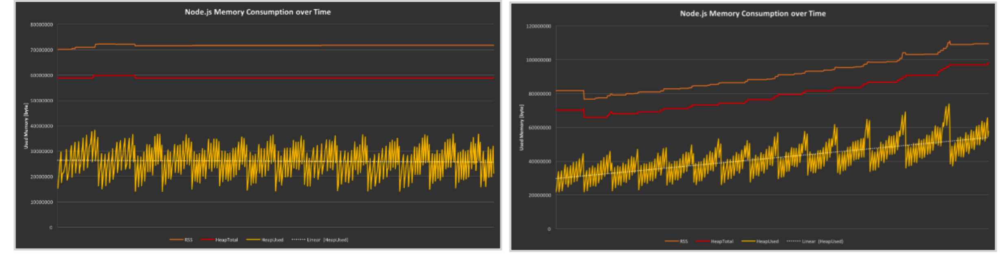
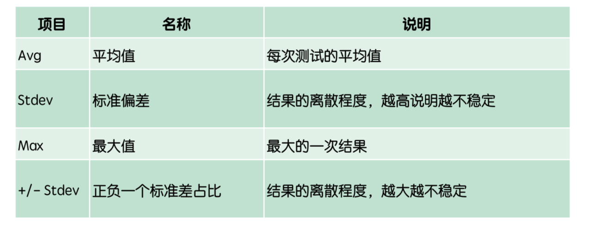
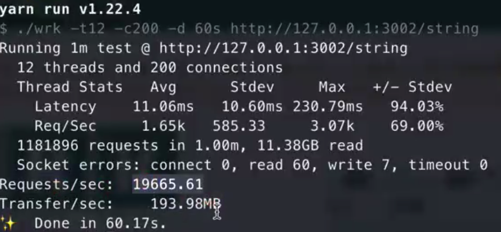
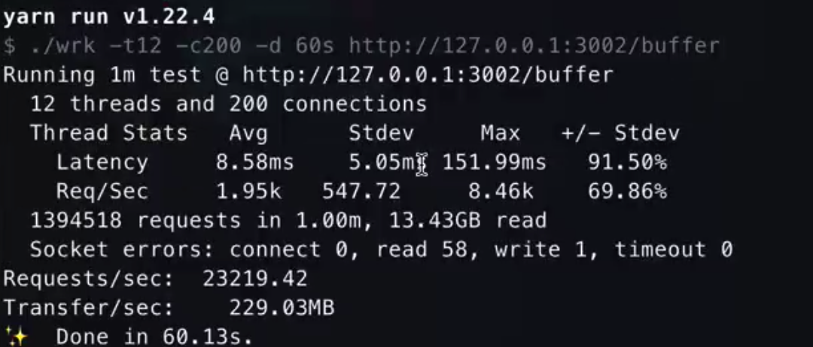

# Nodejs性能调优

## 内存泄露
程序的运行需要内存。只要程序提出要求，操作系统或者运行时（runtime）就必须供给内存。对于持续运行的服务进程（Deamon），必须及时释放不再用到的内存。否则内存占用运来越高。轻则影响系统性能，重则导致进程崩溃。不再用到的内存没有及时释放，就叫做内存泄露。



成锯齿状的是由Scavenge创建的，而出现向下跳跃的是有Mark-Sweep操作产生的。

### 内存泄露的表现
- 随着内存泄露的增长，V8对垃圾收集器越来越具有攻击性，这会使你的应用运行速度变慢。
- 内存泄露可能触发其它类型的失败。内存泄露的代码可能会持续引用有限的资源。可能会导致应用耗尽文件描述符；还可能突然不能建立新的数据库连接。
- 应用迟早会崩溃，并且当应用用户越来越多时肯定会发生
- 浏览器也会发生内存泄露。只不过浏览器只针对一端，会造成网页的卡顿。

### 如何查看是否有内存泄露 

#### 压力测试工具
PV每天几十万甚至上百万就需要考虑压力测试。
:::tip
PV：网站当日访问人数
UV: 独立访问人数
QPS = PV/t: 1000000/10*60*60=27.7（100万请求集中在10个小时，服务器每秒处理27.7个请求）
:::

1. WRK
wrk的参数说明：
- -t 需要模拟的线程数
- -c 需要模拟的连接数
- --timeout 超时时间
- -d 测试的持续时间

例子：
```javascript
 ./wrk -t12 -c400 -d30s http://localhost:8080/

 //用12个线程30s内模拟400个连接。
 //一般线程数不宜过多，核数的2到4倍足够。
```
计算结果


Latency: 可以理解为响应时间
Req/Sec: 每个线程每秒钟完成的请求数
一般来说主要关注平均值和最大值，标准差如果太大说明样本本身离散程度比较高，有可能系统性能波动很大。

2. JMeter
使用场景

- 功能测试
- 压力测试
- 分布式压力测试
- 纯java开发
- 上手容易,高性能
- 提供测试数据分析
- 各种报表数据图形展示

#### 如何获取到程序运行内存？
可以使用node自带的`process.memoryUsage`。
它返回一个对象，包含了Node进程内存占用信息。该对象包含四个字段，单位是字节：

- rss(resident set size)：所有内存占用，包括指令区和堆栈
- heapTotal: 堆占用的内存，包括用到的和没用到的。
- heapUsed：用到的堆的部分
- external: V8引擎内部的C++对象占用的内存。
判断内存泄露，以heapUsed字段为准。 

#### 查找Node内存泄露工具
- memwatch。

它是一个泄漏事件发射器，经过连续5次的GC，内存仍被持续分配没有得到释放，就能生成快照。不过memwatch一般只有在CPU压力达到一定比例时候，才会跳出来memwatch leak。

- heapdump
一个状态事件发射器，可以生成内存快照。如果有内存泄露，heapdump文件会随着时间增加越来越大。

### 引起内存泄露的原因
#### 内存膨胀
内存膨胀主要表现为对内存管理的不规范，本来50M内存可以搞定，却花费了500M内存。

#### 慎用内存缓存
函数内的变量时可以随着执行函数被回收的，但是全局的不行。如果实在业务有需求，应避免使用对象作为缓存，应考虑使用Redis等。

例如:
```javascript
const http = require('http');
const memeye = require('memeye');//监测内存使用的工具
memeye();
let leakArray = [];
// leakArray = null;
const server = http.createServer((req, res) => {
  if (req.url == '/') {
    // const wm = new WeakMap();
    leakArray.push(Math.random());
    // wm.set(leakArray, leakArray);
    // console.log(wm.get(leakArray));
    console.log(leakArray);
    // leakArray = null;
    res.end('hello world');
  }
});
server.listen(3000);

```

还可以使用软引用，让node有机会帮我们释放内存。有得时候设置了null也没有用，是因为node中发现内存够用，并不会执行gc。
```javascript
//直接用node命令执行.global.gc()会报错，要用node --expose-gc xxx.js执行。用d8也可以，是v8的调试工具

global.gc();
//返回当前Node.js使用情况
console.log('第一次', process.memoryUsage());

// let map = new Map();
// let key = new Array(5 * 1024 * 1024);
// map.set(key, 1);
// global.gc();//释放不了
// console.log('第二次', process.memoryUsage());

// // key = null;//不会释放， map中有强引用
// // console.log('第三次', process.memoryUsage());

// map.delete(key);
// key = null;
// global.gc();
// // console.log('第三次', process.memoryUsage());
// console.log('第四次', process.memoryUsage());//会生效


//如果不想主动delete key，可以使用软引用
const wm = new WeakMap();
let key = new Array(5 * 1024 * 1024);
wm.set(key, 1);
key = null;
global.gc();
console.log('第二次', process.memoryUsage());

```

#### 队列消费不及时
这也是一个不经意产生的内存泄露。队列一般在消费者-生产者模型中充当中间人的角色，当消费大于生产时没有问题，但是当生产大于消费时，会产生堆积，就容易发生内存泄露。

比如收集日志，如果日志产生的速度大于文件写入的速度，就容易产生内存泄露(Jmeter接收到全部返回后，服务器log4js日志还在不停的写)。表层的解决办法是换用消费速度更高的技术，但是这不治本。根本的解决办法应该是监控队列的长度，一旦堆积就报警或拒绝新的请求。还有一种是所有的异步调用都有超时回调，一旦达到时间调用未得到结果就报警。


#### 闭包

```javascript
function foo(){
  var temp_object = {
    x:1,
    y:2,
    array: new Array(20000)
  };
  //目前闭包只是引用了closure，可以减少泄露大小
  let closure = temp_object.x;
  return function (){
    console.log(closure);
  }
}

```
foo函数执行完之后，正常要对它进行回收。但是如果返回的函数对temp_object有引用，所以会把对象放到堆区，就得不到回收了。解决的办法是可以用到谁传谁，避免大对象整个复制。

解决闭包内存泄露的方法：null + WeakMap

#### 频发的垃圾回收让GC无机会工作
```javascript
function strToArray(str) {
  let i = 0;
  const len = str.length;
  let arr = Array(len);
  for (; i < len; i++) {
    arr[i] = str.charCodeAt(i) + Math.random();
  }
  return arr;
}
function foo() {
  let i = 0;
  let str = 'test v8 GC';
  while (i++ < 10000) {
    strToArray(str);
  }
}
foo();
```
频繁的创建对象然后失效，会导致新生代占满，会导致新的对象申请失效。

解决办法之一是让申请的内存有效。
```javascript
function strToArray(str, bufferView) {
  let i = 0;
  const len = str.length;
  for (; i < len; i++) {
    bufferView[i] = str.charCodeAt(i) + Math.random();
  }
  return bufferView;
}
function foo() {
  let i = 0;
  let str = 'test v8 GC';
  // SharedArrayBuffer = 连续的内存
  let bufferView = [];
  while (i++ < 10000) {
    strToArray(str, bufferView);
  }
}
foo();
```
可以使用`perf_hooks`这个库及时统计代码运行AB比较，避免代码执行逻辑过于复杂，无GC机会。

```javascript
const {performance} = require("perf_hooks");
performance.mark("A")
setTimeout(() => {
  performance.mark("B");
  performance.measure("A to B", "A", "B");
  const entry = performance.getEntriesByName("A to B", measure);
  console.log(entry.duration);
}, 100000);

```
#### DOM内存泄露

```javascript
<!DOCTYPE html>
<html lang="en">
  <head>
    <meta charset="UTF-8" />
    <meta name="viewport" content="width=device-width, initial-scale=1.0" />
    <title>dom内存泄漏</title>
  </head>
  <body>
    <!--只有同时满足 DOM 树和 JavaScript 代码都不引用某个 DOM 节点，该节点才会被作为垃圾进行回收。 
        如果某个节点已从 DOM 树移除，但 JavaScript 仍然引用它，我们称此节点为“detached ”。
        因为 DOM 元素依然会呆在内存中。
        “detached ”节点是 DOM 内存泄漏的常见原因。-->
    <script>
      //万万记得避免全局变量 "use strict"
      //同时也要避免在函数内部不使用var的声明
      let detachedTree;
      function create() {
        var ul = document.createElement('ul');
        for (var i = 0; i < 100; i++) {
          var li = document.createElement('li');
          ul.appendChild(li);
        }
        detachedTree = ul;
      }
      create();
      //   detachedTree = null;//置为null可以回收
    </script>
    <script>
      //清除定时器⏲否则永远会保持对函数的引用
      function setCallback() {
        // 'unpacking' the data object
        let counter = 0;
        const hugeString = new Array(100000).join('x'); // gets removed when the setCallback returns
        return function cb() {
          counter++; // only counter is part of the callback's scope
          console.log(counter);
        };
      }
      const timerId = setInterval(setCallback(), 1000); // saving the interval ID
      clearInterval(timerId); // stopping the timer i.e. if button pressed
    </script>
  </body>
</html>

```

#### 事件监听
```javascript
<!DOCTYPE html>
<html lang="en">
  <head>
    <meta charset="UTF-8" />
    <meta name="viewport" content="width=device-width, initial-scale=1.0" />
    <title>前端内存泄漏粒子2</title>
  </head>
  <body>
    <script>
      // 事件监听存在于匿名函数 所以也无法移除
      const hugeString = new Array(100000).join('x');
      document.addEventListener('keyup', function () {
        // anonymous inline function - can't remove it
        doSomething(hugeString); // hugeString is now forever kept in the callback's scope
      });

      //解决办法：终创建指向事件侦听器的引用并将其传递给 removeEventListener()，来注销不再需要的事件侦听器。
      function listener() {
        doSomething(hugeString);
      }
      document.addEventListener('keyup', listener); // named function can be referenced here...
      document.removeEventListener('keyup', listener); // ...and here

      //再或者创建只执行一次的监听函数
      document.addEventListener(
        'keyup',
        function listener() {
          doSomething(hugeString);
        },
        { once: true }
      ); // listener will be removed after running once
    </script>
  </body>
</html>

```

#### 游离的DOM元素
```javascript
<!DOCTYPE html>
<html lang="en">
  <head>
    <meta charset="UTF-8" />
    <meta name="viewport" content="width=device-width, initial-scale=1.0" />
    <title>游离的DOM元素2</title>
  </head>
  <body>
    <script>
      function createElement() {
        const div = document.createElement('div');
        div.id = 'detached';
        return div;
      }
      // this will keep referencing the DOM element even after deleteElement() is called
      const detachedDiv = createElement();
      document.body.appendChild(detachedDiv);
      function deleteElement() {
        document.body.removeChild(document.getElementById('detached'));
      }
      deleteElement(); // Heap snapshot will show detached div#detached
    </script>
    <!--解决办法是将 DOM 引用移入本地域。-->
    <script>
      function createElement() {
        // same as above
      }
      // DOM references are inside the function scope
      function appendElement() {
        const detachedDiv = createElement();
        document.body.appendChild(detachedDiv);
      }
      appendElement();
      function deleteElement() {
        document.body.removeChild(document.getElementById('detached'));
      }
      deleteElement(); // no detached div#detached elements in the Heap Snapshot
    </script>
  </body>
</html>


```

####  对象
```javascript
<!DOCTYPE html>
<html lang="en" dir="ltr">
  <head>
    <meta charset="utf-8" />
    <title>对象的探索</title>
  </head>

  <body>
    <script type="text/javascript">
      // 1.然后选择“Memory”标签，点击"take snapshot" 获取V8的堆内存快照。
      // 2:然后“command+f"(mac) 搜索“setName”，setName对象下面包含了shared
      // 3.raw_outer_scope_info_or_feedback_metadata，对闭包的引用数据就在这里面。
      function foo() {
        var myName = '京程一灯';
        var innerBar = {
          setName: function (newName) {
            myName = newName;
          },
        };
        return innerBar;
      }
      var bar = foo();
      bar.setName('京程一灯🏮');
    </script>
  </body>
</html>

```

### 总结
- node --inspect app.js
- chrome://inspect/#devices
- 没经过压力测试的Node代码基本只完成10%
- 准确计算QPS 未雨绸缪
- 合理利用压力测试工具
- 缓存队列 内存泄露 耗时较长的代码
- 开发健壮的NodeJS应用

### 调试神器
- [https://clinicjs.org](https://clinicjs.org) node性能检测最好的库
- [https://youjinyu.github.io/clinic-doc-zh](https://youjinyu.github.io/clinic-doc-zh)
- memeye


## Buffer

### Stream和Buffer的概念
Stream是有方向性的，当程序从某个数据源读入数据，会开启一个输入流，这里的数据源可以是文件或者网络等。例如我们从a.txt文件读入数据。相反的，当程序需要写出数据到指定数据源时，则开启一个输出流。当有一些大文件操作时，就需要Stream像管道一样，一点一点的将数据流出。

通常，数据的移动是为了处理或者读取它，并根据它进行决策。伴随着时间的推移，每一个过程都会有一个最小或最大数据量。如果数据到达的速度比进消耗的速度快，那么少数早到达的数据会处于等待区等候处理。反之，如果数据到达的速度比进程消耗的数据慢，那么早先到达的数据需要等待一定量的数据到达之后才能被处理。

### Buffer和String的性能瓶颈

### Buffer的垃圾回收机制
Buffer需要处理大量的二进制数据，假如用一点就向系统去申请，会造成频繁的向系统申请内存调用，所以Buffer所占用的内存不再由V8分配，而是在Nodejs的C++层完成申请，在JavaScript中进行内存分配。因此，这部分分配的内存称之为堆外内存。

Nodejs采用了Slab机制进行预先申请、事后分配，是一种动态的管理机制。使用Buffer.alloc(size)传入一个指定的size就会申请一块固定大小的内存区域。

Nodejs以8KB为界限来区分是小对象还是大对象。另外，在初始化的同时还初始化了一个新的变量poolOffset=0。这个变量会记录已经使用了多少字节。[buffer源码](https://github.com/nodejs/node/blob/master/lib/buffer.js)

**回收机制总结**
1. 在初次加载时就会初始化一个8KB的内存空间，buffer.js源码有体现。
2. 根据申请的内存大小分为 小Buffer对象和大Buffer对象。小Buffer情况，会继续判断这个slab空间是否足够。
3. 如果空间足够就使用剩余空间，同时更新slab分配状态，偏移量会增加。如果空间不足，slab空间不足，就会去创建一个新的slab空间用来分配。
4. 大Buffer情况，会直接走createUnsafeBuffer(size)函数
5. 不论是小Buffer对象还是大Buffer对象，内存分配都是在C++层完成，内存管理在Javascript层，最终还是可以被V8的垃圾回收标记所回收。


### 使用buffer

```javascript
const http = require('http');

let s = '';
for (let i = 0; i < 1024 * 10; i++) {
  s += 'a';
}

const str = s;
const buffStr = Buffer.from(s);

const server = http.createServer((req, res) => {
  if (req.url == '/buffer') {
    res.end(buffStr);
  } else if (req.url == '/string') {
    res.end(str);
  }
});
server.listen(3002);

```
测试1，不用buffer：
```javascript
./wrk -t12 -c400 -d 60s http://127.0.0.1:3002/string
```
结果：


测试2，使用buffer:
```javascript
./wrk -t12 -c400 -d 60s http://127.0.0.1:3002/buffer
```
结果：

可以看到平均响应时间和QPS都得到很大的提升。

**实际项目的使用**
在Node端渲染出html后，用stream的Readable流式吐出：

```javascript
import {Readable} from 'stream';

  function createSSRSreamPromise() {
    //流式输出html 防止html过大影响渲染 造成白屏时间太长
    return new Promise((resolve, reject) => {
      const bufferStream = new Readable();
      bufferStream.push(html);
      bufferStream.push(null);
      ctx.status = 200;
      ctx.type = "html";
      bufferStream.on("error", (err) => {
        console.log();
      }).pipe(ctx.res);
    })
  }
  await createSSRSreamPromise();
```


