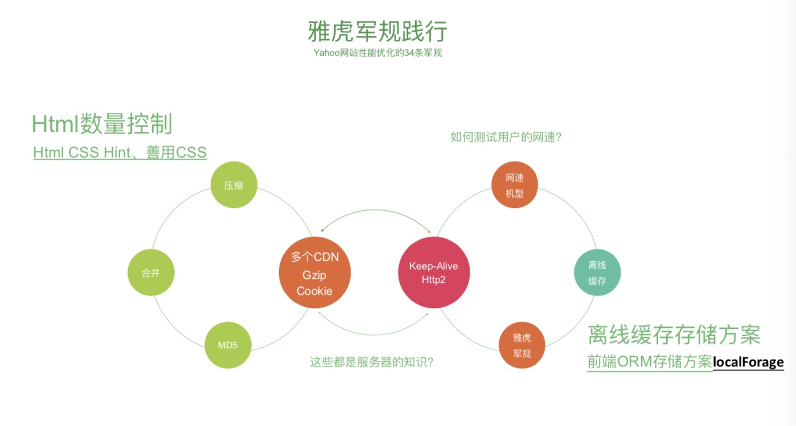

# 性能优化启示录

## 为什么要做性能优化
- 57%的用户更在乎网页在3秒内是否完成加载
- 52%的在线用户认为网页打开速度影响到他们对网站的忠实度
- 每慢1秒造成页面PV降低11%，用户满意度也随之降低16%
- 近半数移动用户因为在10秒内仍未打开页面从而放弃

## 性能优化学徒工
### 雅虎军规

- 压缩与合并之间有一个平衡点。webpack打包优化提取公共css或js文件时，当提取的文件大于30kb时才会提取出来。浏览器并发请求数5-6个比较合适，每个请求100kb左右。
- 用md5做精准缓存
- 多个CDN。CDN为什么更快？CDN的本质是将媒体资源，动静态图片（Flash），HTML，CSS，JS等等内容缓存到距离你更近的数据中心，从而让用户进行共享资源，实现缩减站点间的响应时间等等需求。再者，CDN不会携带额外的cookie。多CDN可以解决浏览器对同一个域名的并发访问过大问题。

### 缓存策略
 Http缓存
- cache-control
- expires
- etag
- last-modified

离线缓存的几种方式
- Local Storage。同步读取。
- Session Storage
- IndexedDb。异步读取。
- basket.js

1. 一般常用的库 jquery做http强缓存，对版本要求不严格
2. 业务代码需要本地缓存。md5变化是非常频繁的，用http缓存意义不大且经常会缓存失败。
([Http缓存](/web-front/nodejs/http-cache.md))

### 网站协议
将站点改成HTTP/2的请求。

浏览器请求//xx.cn/a.js-->解析域名—>HTTP连接—>服务器处理文件—>返回数据-->浏览器解析、渲染文件。Keep-Alive解决的核心问 题就在此，一定时间内，同一域名多次请求数据，只建立一次HTTP请求，其他请求可复用每一次建立的连接通道，以达到提高请求 效率的问题。一定时间是可以配置的，HTTP1.1还是存在效率问题，第一个:串行的文件传输。第二个:连接数过多。HTTP/2对同一 域名下所有请求都是基于流，也就是说同一域名不管访问多少文件，也只建立一路连接。同样Apache的最大连接数为300，因为有了 这个新特性，最大的并发就可以提升到300，比原来提升了60倍!

### 小字为先