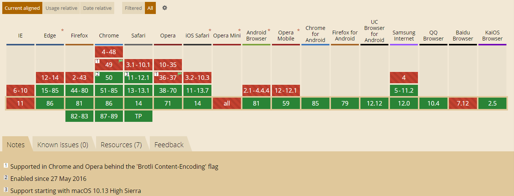

# 雅虎军规
[Best Practices for Speeding Up Your Web Site 原文链接](https://developer.yahoo.com/performance/rules.html)
Yahoo性能优化团队总结了让网页更快的七大类35条最佳实践。

## 1. 减少HTTP请求
80%的终端用户响应时间都花在了前端上，其中大部分时间都在下载页面上的各种组件：图片，样式表，脚本，Flash等等。减少组件数必然能够减少页面提交的HTTP请求数。这是让页面更快的关键。

减少页面组件数的一种方式是简化页面设计。但有没有一种方法可以在构建复杂的页面同时加快响应时间呢？下面是一些较少HTTP请求的同时也支持复杂页面设计的技巧。

- 合并文件。合并文件是将所有的scripts都合并到一个script中，类似的也可以将所有的CSS合并到一个stylesheet中。如果各个页面的脚本和样式不一样的话，合并文件就是一项比较麻烦的工作了，但把这个作为站点发布过程的一部分确实可以提高响应时间。

- CSS Sprites（雪碧图）。CSS Sprites是减少图片请求数量的首选方式。把背景图片都整合到一张图片中，然后用CSS的background-image和background-position属性来定位要显示的部分。

- Image maps。图像映射可以把多张图片合并成单张图片，总大小是一样的，但减少了请求数并加速了页面加载。图片映射只有在图像在页面中连续的时候才有用，比如导航条。给image map设置坐标的过程既无聊又容易出错，用image map来做导航也不容易，所以不推荐用这种方式。

- Inline images 。 行内图片（Base64编码）用data: URL模式来把图片嵌入页面。这样会增加HTML文件的大小，把行内图片放在（缓存的）样式表中是个好办法，而且成功避免了页面变“重”。但目前主流浏览器并不能很好地支持行内图片。

## 2. 使用CDN
CDN是Content Delivery Network的缩写。用户与服务器的物理距离对响应时间也有影响。把内容部署在多个地理位置分散的服务器上能让用户更快地载入页面。但具体要怎么做呢？

实现内容在地理位置上分散的第一步是：不要尝试去重新设计你的web应用程序来适应分布式结构。这取决于应用程序，改变结构可能包括一些让人望而生畏的任务，比如同步会话状态和跨服务器复制数据库事务）。缩短用户和内容之间距离的提议可能被推迟，或者根本不可能通过，就是因为这个难题。

记住终端用户80%到90%的响应时间都花在下载页面组件上了：图片，样式，脚本，Flash等等，这是业绩黄金法则。最好先分散静态内容，而不是一开始就重新设计应用程序结构。这不仅能够大大减少响应时间，还更容易表现出CDN的功劳。

内容分发网络（CDN）是一组分散在不同地理位置的web服务器，用来给用户更高效地发送内容。典型地，选择用来发送内容的服务器是基于网络距离的衡量标准的。例如：选跳数（hop）最少的或者响应时间最快的服务器。

## 3. 添加Expires或者Cache-Control HTTP头
这条规则有两个方面：

- 对于静态组件：通过设置一个遥远的将来时间作为Expires来实现永不失效
- 对余动态组件：用合适的Cache-ControlHTTP头来让浏览器进行条件性的请求
网页设计越来越丰富，这意味着页面里有更多的脚本，图片和Flash。站点的新访客可能还是不得不提交几个HTTP请求，但通过使用有效期能让组件变得可缓存，这避免了在接下来的浏览过程中不必要的HTTP请求。有效期HTTP头通常被用在图片上，但它们应该用在所有组件上，包括脚本、样式和Flash组件。

浏览器（和代理）用缓存来减少HTTP请求的数目和大小，让页面能够更快加载。web服务器通过有效期HTTP响应头来告诉客户端，页面的各个组件应该被缓存多久。用一个遥远的将来时间做有效期，告诉浏览器这个响应在2010年4月15日前不会改变。

```Expires: Thu, 15 Apr 2010 20:00:00 GMT```

如果你用的是Apache服务器，用ExpiresDefault指令来设置相对于当前日期的有效期。下面的例子设置了从请求时间起10年的有效期：

```ExpiresDefault "access plus 10 years"```

## 4. Gzip组件
前端工程师可以想办法明显地缩短通过网络传输HTTP请求和响应的时间。毫无疑问，终端用户的带宽速度，网络服务商，对等交换点的距离等等，都是开发团队所无法控制的。但还有别的能够影响响应时间的因素，压缩可以通过减少HTTP响应的大小来缩短响应时间。

从HTTP/1.1开始，web客户端就有了支持压缩的Accept-Encoding HTTP请求头。

`Accept-Encoding: gzip, deflate`

如果web服务器看到这个请求头，它就会用客户端列出的一种方式来压缩响应。web服务器通过Content-Encoding相应头来通知客户端。

`Content-Encoding: gzip`

Gzip是当前最流行也是最有效的压缩方法。它大约可以减少70%左右的response大小。浏览器对于Gzip的支持如下：


服务器会根据文件类型选择gzip内容，但通常在决定压缩内容方面受到限制。大部分web站点会gzip Html。gzip脚本和样式表也是值得的，但是许多网站都没有这么做。实际上，压缩任何文本响应（包括XML和JSON）都是值得的。图片和PDF文件不应压缩，因为它们已经被压缩。尝试对其进行gzip压缩不仅浪费CPU，而且可能会增加文件大小

压缩尽可能多的文件类型是减轻页面大小和加快用户体验的简便方法。

## 5. 把样式表放在顶部
在Yahoo!研究性能的时候，我们发现把样式表放到文档的HEAD部分能让页面看起来加载地更快。这是因为把样式表放在head里能让页面逐步渲染。

关注性能的前端工程师想让页面逐步渲染。也就是说，我们想让浏览器尽快显示已有内容，这在页面上有一大堆内容或者用户网速很慢时显得尤为重要。给用户显示反馈（比如进度指标）的重要性已经被广泛研究过，并且被记录下来了。在我们的例子中，HTML页面就是进度指标！当浏览器逐渐加载页面头部，导航条，顶部logo等等内容的时候，这些都被正在等待页面加载的用户当作反馈，能够提高整体用户体验。

## 6. 把脚本放在底部
脚本会阻塞并行下载，HTTP/1.1官方文档建议浏览器每个主机名下并行下载的组件数不要超过两个，如果图片来自多个主机名，并行下载的数量就可以超过两个。如果脚本正在下载，浏览器就不开始任何其它下载任务，即使是在不同主机名下的。

有时候，并不容易把脚本移动到底部。举个例子，如果脚本是用document.write插入到页面内容中的，就没办法再往下移了。还可能存在作用域问题，在多数情况下，这些问题都是可以解决的。

一个常见的建议是用推迟（deferred）脚本，有DEFER属性的脚本意味着不能含有document.write，并且提示浏览器告诉他们可以继续渲染。不幸的是，Firefox不支持DEFER属性。在IE中，脚本可能被推迟，但不尽如人意。如果脚本可以推迟，我们就可以把它放到页面底部，页面就可以更快地载入。

## 7. 避免CSS表达式
用CSS表达式动态设置CSS属性，是一种强大又危险的方式。从IE5开始支持，但从IE8起就不推荐使用了。例如，可以用CSS表达式把背景颜色设置成按小时交替的：
```
 background-color: expression( (new Date()).getHours()%2 ? "#B8D4FF" : "#F08A00" );
 ```
 使用CSS表达式的问题在于，它比我们想象的要执行的更频繁。这些表达式吧不仅在页面重新渲染或者resize的时候会执行，在页面滚动甚至是鼠标移动到页面时都会执行。

 如果一定要使用CSS表达式，一个减少执行次数的方法是在第一次执行完后把表达式替换为静态属性。但是这样就做不到动态修改了。如果需要动态修改，可以把修改的事件放到组件的生命周期，或者各种event handler中。